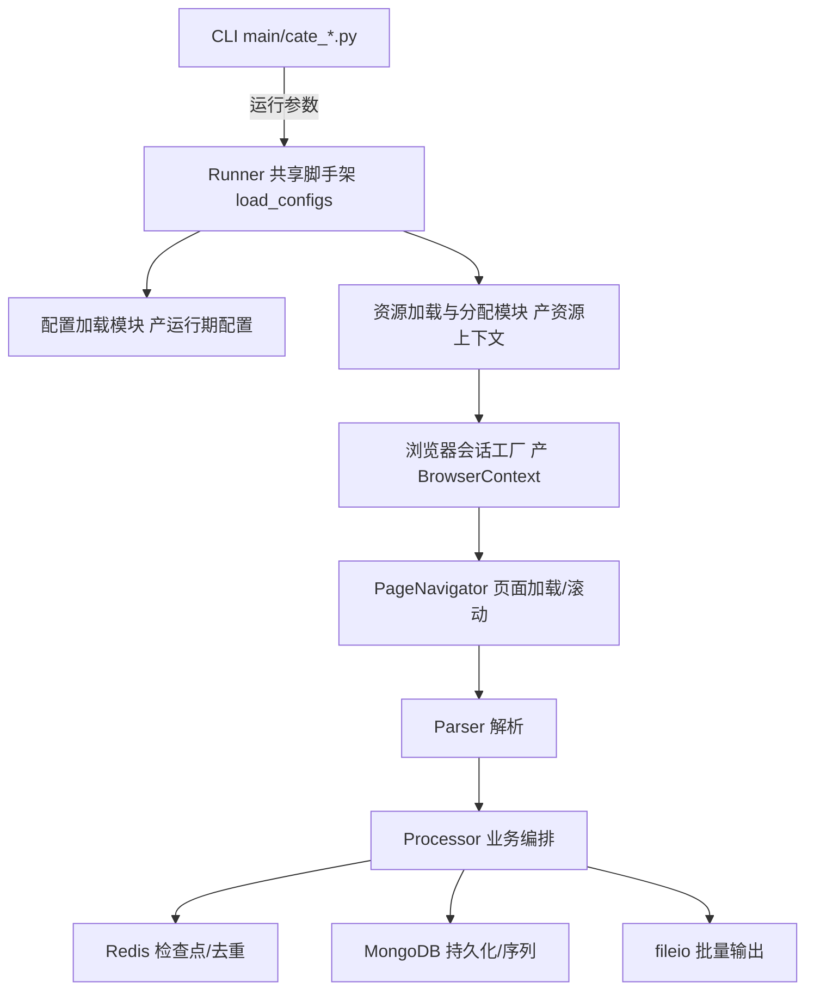
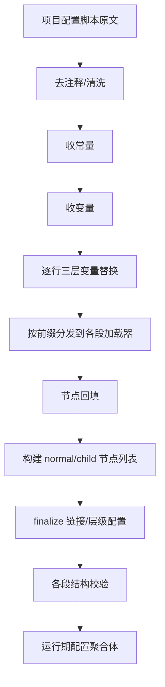
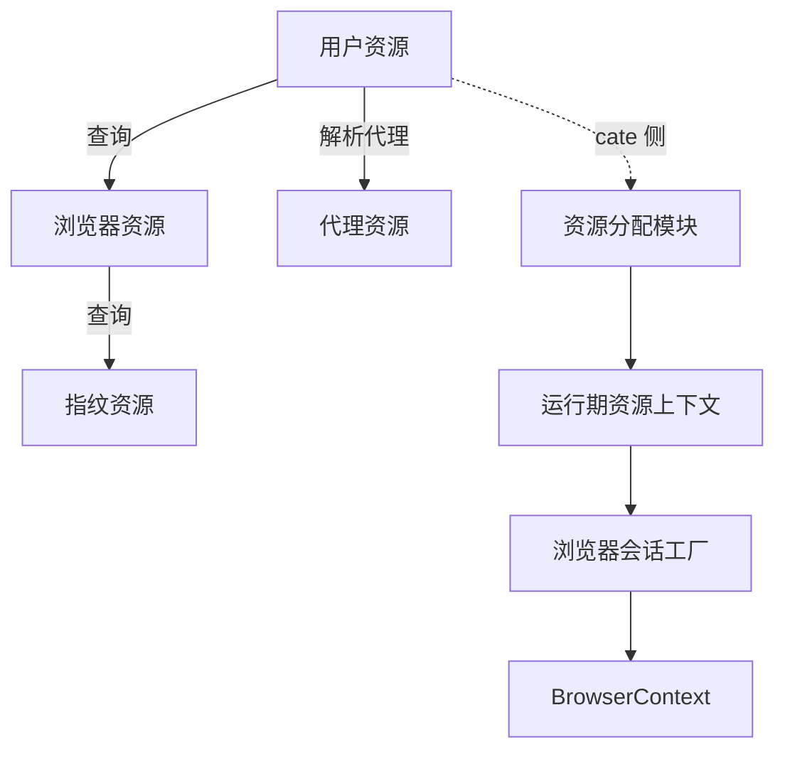
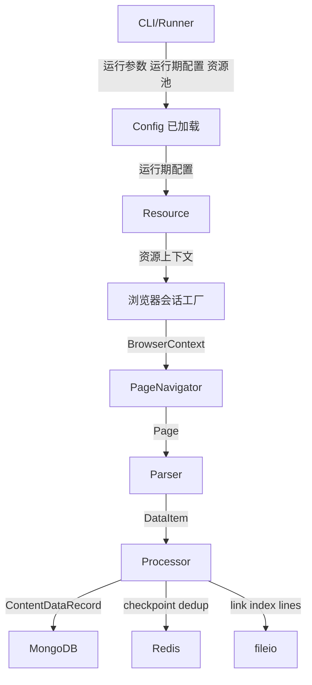
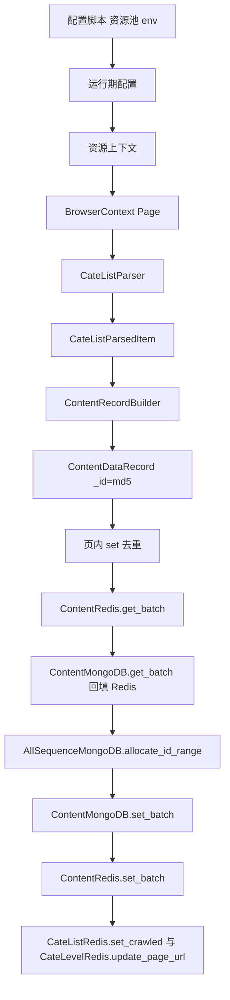

<p align="left">
  README Navigation
</p>

<p align="left">
  <strong>root</strong>
</p>

<pre>
root
│
├ <a href="./README.md">README.md</a>                项目架构全面分析报告.md
│
└ <strong>核心模块详细设计分析_脱敏版.md</strong>     核心模块详细设计（脱敏版）
</pre>

---

# 核心模块详细设计分析（脱敏版）

> 本报告基于对 ``\python-playwright-web-crawler`` 实际源码的只读分析。结论分四级标注：【代码确认】源码可直接确认；【高度推断】由多处调用关系合理推断但无单点定义；【无法确认】源码不足以确认；【设计建议】对当前实现的建议，非现有事实。
>
> **脱敏说明**：为保护未公开内容，本版对项目配置脚本（`script/script.txt`）、采集配置加载器（`config/loader/`）、资源体系（`resource/`、`pool/`）、分类树与自动分类算法（`mini_cate/`）以及三个核心采集处理器（`processor/cate_list/cate_list_processor.py`、`processor/cate_level/cate_level_processor.py`、`processor/cate_level/cate_level_collector.py`）只做"架构 / 职责 / 模块关系"级说明，不公开其源码级实现细节。其余公开模块仍保持原详细分析。凡两报告不一致处，本报告以源码为准并明确指出差异。

---

## 1. 文档说明

本报告是项目第二阶段深度分析。第一阶段《项目架构全面分析报告》解决"整体架构/模块划分/目录职责"问题；本报告解决"核心模块内部如何设计、如何执行、如何扩展"问题。读者对象：具备 Python/Java/爬虫经验的工程师，仅阅读本报告与第一阶段报告即可基本接手项目。

本报告不重复第一阶段的目录树、技术栈、项目简介。所有泛泛的"模块化、可扩展、高内聚低耦合"陈述已剔除；公开模块的结论尽可能落到 `文件路径::类.函数()` 级证据；未公开模块仅落到模块职责级。

---

## 2. 分析范围与方法

**范围**：CLI / Config / Resource / Browser / Page / Parser / Processor / Database / Data Model / Cookie-Login-Risk-CAPTCHA / Network Response 拦截 / 滚动分页 / 异常重试 Checkpoint。业务类型：CATE_LEVEL / CATE_LIST / DETAIL / ITEM_DETAIL。

**方法**：
1. 通读第一阶段架构报告建立背景。
2. 对核心源文件做源码级全文件读取（非摘要），建立类关系、函数调用、数据流、配置流、资源流、状态流。
3. 与第一阶段报告交叉比对，不一致处以源码为准并标注。
4. 按统一模板（职责/核心文件/核心类/核心函数/输入/输出/内部执行流程/核心调用链/数据流/状态变化/配置依赖/外部依赖/异常处理/扩展点/设计评价）逐模块分析。
5. Mermaid 图：公开模块以源码为依据、节点均有对应类/函数；涉及未公开模块的图改为模块级关系图。

**与第一阶段报告的差异（先列总览，后文展开）**：
1. 【代码确认】`BROWSER_TYPE_NAMES` 在 `constants/path_const.py:165-168` 定义为 `{0:"chromium",1:"chrome"}`；浏览器会话工厂内部另维护一份浏览器类型名表，与前者不一致。第一阶段报告未发现此分歧。
2. 【代码确认】`_PAGE_TYPE_ATTR`（`page/page_navigator.py:43-50`）仅 6 键（HOME/LOGIN/RISK/CATE_LEVEL/CATE_LIST/DETAIL），**无 ITEM_DETAIL**；`config/model/page/page_item.py` 无 `item_detail_ready_selector` 字段。第一阶段报告暗示 7 键含 ITEM_DETAIL，与源码不符。
3. 【代码确认】`page/` 目录无 `__init__.py`，非正规包；`resource/` 目录为正规包。
4. 【代码确认】分类列表编排模块中的滑块校验占位桩恒返回真值，导致 PAUSE 模式的"等待人工"循环在首迭代即退出——实际未起到暂停等待人工作用。第一阶段报告仅称"占位"，未指出 PAUSE 因此失效。
5. 【代码确认】运行期配置聚合体由各业务段配置对象与内容类型字段组成；其精确结构与第一阶段报告的笼统表述存在差异（详见 §5）。

---

## 3. 核心模块总览

核心模块（按运行链顺序，源码确认；未公开模块仅列职责）：

| # | 模块 | 代表文件 | 核心类/函数 |
|---|---|---|---|
| 1 | CLI/Runner | `main/cli/args_parser.py`、`main/cli/runner_base.py`、`main/cate_level.py`、`main/cate_list.py` | `parse_cli_args`、`CateRunArgs`、`create_logger`、`load_configs` |
| 2 | Config | `config/context/*`、`config/backfill/node_config_backfill.py`、`config/model/*`、`config/application/*`、`config/database/*`（公开）；配置加载模块（`config/loader/`，未公开） | 三层变量替换（`pro_var`/`script_constant`/`script_var`/`node_var`）、节点回填校验（`config/backfill`）；配置加载模块产出运行期配置聚合体（未公开） |
| 3 | Resource | 资源体系模块（`resource/`、`pool/`，未公开） | 资源加载 / 映射 / 分配 / 浏览器会话工厂（实现未公开） |
| 4 | Browser/Page | `page/page_navigator.py`、`page/page_ready_checker.py`（公开）；浏览器会话工厂（`resource/`，未公开） | `PageNavigator.load`/`scroll_to_load_more`、`PageReadyChecker.wait`（公开）；浏览器会话创建（未公开） |
| 5 | Parser | `parser/field_extractor.py`、`selector_parser.py`、`parser/cate_level/cate_level_parser.py`、`parser/cate_list/cate_list_parser.py` | `FieldExtractor.extract`、`SelectorParser.extract_values`、`CateLevelParser`、`CateListParser` |
| 6 | Processor | `processor/cate_level/*`（除处理器/采集器）、`processor/cate_list/*`（除处理器）、`processor/item_detail/*`、`processor/common/*`、`processor/unit/*`（公开）；分类层级处理器、分类层级采集器、分类列表处理器（未公开） | `CateLevelRunner`、`CateListRunner`、`ItemDetailProcessor`、`CateLevelLinkBuilder`/`LinkNormalizer`/`ItemHandler`、`ContentRecordBuilder`、`DuplicateChecker`（公开）；层级编排/采集、列表编排（未公开） |
| 7 | Database | `database/mongodb/*`、`database/redis/*` | `ContentMongoDB`、`AllSequenceMongoDB`、`CateLevelRedis`、`CateListRedis`、`ContentRedis` |
| 8 | Data Model | `data/model/data_record/content_data_record.py`、`data/model/cate_*/*`、`config/model/*` | `ContentDataRecord`、`ContentCommonData`、`CateListParsedItem` |

辅助层：`fileio/batch/*`（`StructuredBatchFile`、`TxtBatchFile`）、`request/retry_manager.py`、`utils/delay_manager.py`、分类树与自动分类模块（`mini_cate/`，未公开）、`mouse_tracks/`、`captcha/`。

核心执行链（模块级，源码确认）：



---

## 4. CLI / Runner 详细设计

### 4.1 模块职责
解析命令行参数 → 标准化为运行参数 → 定位项目目录 → 初始化日志路由与目录 → 加载共享配置与资源 → 调起业务 Processor。CLI 与 Processor 的边界：CLI 不做 DOM/数据/写库，只做参数与资源装配。

### 4.2 核心文件
- `main/cli/args_parser.py`：`CateRunArgs`、`parse_cli_args`、dev 预设
- `main/cli/args_utils.py`：`validate_project_id`、`parse_user_indexes`、`parse_cate_indexes`
- `main/cli/index_spec.py`：`IndexSpec`、`parse_index_spec`
- `main/cli/sort_spec.py`：`SoSpec`、`parse_and_validate_so`、`SoValidationError`
- `main/cli/runner_base.py`：`create_logger`、`setup_directories`、`load_configs`、`_setup_root`
- `main/cate_level.py`、`main/cate_list.py`：业务入口 `main()`
- `main/cli/item_detail/item_args.py`、`item_index_spec.py`、`main/item_detail/item_detail.py`：ITEM_DETAIL 入口

### 4.3 核心类
- `@dataclass CateRunArgs`（`args_parser.py:103`）：`env`、`project_id`、`user_indexes`、`user_arg_raw`、`cate_indexes`、`cli_arg_raw`、`cli_is_ut`、`so_arg_raw`、`so_is_ut`、`preset`。
- `@dataclass ItemRunArgs`（`item_args.py:51`）：`env`、`project_id`、`user_indexes`、`item_index_spec`、`item_arg_raw`、`item_is_ut`、`preset`。
- `@dataclass SoSpec`（`sort_spec.py:42`）：`mode`（none/default/ut/field/field_order）、`field`、`order`、`raw`；`to_sort_program_vars()` 调 `build_sort_program_vars`。
- `@dataclass IndexSpec`（`index_spec.py:56`）：`all`、`indexes`。
- `@dataclass ItemIndexSpec`（`item_index_spec.py:47`）：`all`、`indexes`；**不支持逗号列表**（与 `IndexSpec` 不同）。

dev 预设（`args_parser.py:145-149`）：`PRESET_PROJECT_ID="1001-001"`、`PRESET_USER_INDEXES="0-2"`、`PRESET_CATE_INDEXES="0>1-3"`、`PRESET_SO="-1"`。item_detail 预设（`item_args.py:75-77`）：`PRESET_PROJECT_ID="1051-001"`、其余 `"-1"`。

### 4.4 核心函数
- `parse_cli_args(*, cate_keyword, cate_label, sort_keyword=None, sort_label="sort and order")`（`args_parser.py:428`）：argparse `--dev`/`--pro` + 位置 `params`；循环解析 `p`/`u`/cate_keyword/sort_keyword 键值对；冲突检查（cli_is_ut 与 user -1、so_is_ut 与 user -1）；dev 0 参数则套预设。
- `parse_and_validate_so(value, *, sort_fields, sort_order_supported_fields, sort_order_values, allow_ut=True)`（`sort_spec.py:79`）：5 格式 `-1`(none)/`0`(default)/`ut`/`field|order`/单 `field`；校验 field∈sort_fields、field∈supported_fields、order∈sort_order_values、field 无逗号。
- `create_logger(name, log_dir, project_id, level=INFO)`（`runner_base.py:78`）：命名 logger `propagate=False`；`_setup_root` 把文件 handler 挂到 root（带 `_PPW_FILE_TAG` 标签），叶子模块传播日志落到当前阶段文件。
- `load_configs(project_loader, logger)`（`runner_base.py:169`）：依序调用配置加载模块（解析项目配置为运行期配置聚合体）→ 资源加载模块（加载资源池）→ 取项目变量 → 解析运行期配置 → 打印配置摘要；返回 `(script_config, project_config, pool_data, pool_loader)`。被引用模块的内部实现不展开。

### 4.5 输入 / 输出
- 输入：命令行 `params`（cate: `p`/`u`/`clli`/`so`；item: `id_p`/`id_u`/`id_i`）。
- 输出：`CateRunArgs`/`ItemRunArgs` + 已加载运行期配置 + 资源池数据 + logger。

### 4.6 内部执行流程（CATE_LEVEL `main/cate_level.py:main`，源码确认）
```
parse_cli_args(cate_keyword="clli")
 → create_logger("cate_level", BASE_DIR/logs, project_id)
 → 配置加载器实例（按 full_project_id 定位项目目录）
 → load_configs(project_loader, main_logger)   # 局部函数，逻辑同 runner_base
 → create_logger(f"project_{full_id}", project_dir/logs)
 → setup_directories(project_dir, logger)
 → 用户校验块：need_login 检查；u=-1 + need_login=1 报错；u=-1 + need_login=0 → 资源分配模块的无用户路径
 → 选中用户：校验用户浏览器/IP 资源；clii=ut 读用户配置的 cate_link_index 列
 → 资源分配模块.allocate(user_index) → 资源上下文
 → execute_cate_level(...) → processor.cate_level.cate_level_runner.run_cate_level(...)
```
CATE_LIST（`main/cate_list.py`）额外：加载 `CateLevelIndexDataLoader.load` 与 `CateLevelLinkDataLoader.load`，索引非空时 `CateLevelLinkDataBackfill.backfill` 回填 `cate_ids_path`/`cate_links_path`；`so` 经 `parse_and_validate_so` 校验；clii=ut 读用户配置的 `cate_level_index` 列，so=ut 读用户配置的 `sort_and_order` 列（`allow_ut=False`）。

ITEM_DETAIL（`main/item_detail/item_detail.py`）：`parse_item_cli_args` → item 侧配置加载模块 → item 用户池加载 → `_resolve_item_users`/`_resolve_item_index_spec`（id_i=ut 需单一用户，读其 `id_i`，禁嵌套 ut）/`_read_and_select_item_urls` → item 侧运行期配置解析 → `run_item_detail`。

### 4.7 状态变化 / 配置依赖 / 外部依赖
- 状态：参数字符串 → 标准化 `CateRunArgs`（ut 标志 + 解析后 spec）→ 资源上下文。
- 配置依赖：`env/dev.yaml|pro.yaml`（`--dev`/`--pro`）；站点目录名（`{main}-{sub}-{site}-{content}-{lang}`）。
- 外部依赖：argparse、openpyxl（资源池读取）、`env/*.yaml`、文件系统（项目目录、logs）。

### 4.8 异常处理
- `ProjectNotFoundError`/`ProjectAmbiguousError` 由配置加载模块抛出，main 捕获并退出；`ProjectNotFoundError` 在 `main/cate_level.py:557` 显式 catch。
- 参数冲突（ut 与 user -1）`_exit_with_error` → `sys.exit(2)`。
- `RuntimeError`（item 项目目录多于一个）。

### 4.9 扩展点
- 新增业务类型：在 `main/` 加入口；在 `processor/<biz>/` 加 Runner+Processor；item_detail 已示范独立 CLI 子树。
- 新增参数：扩展 `parse_cli_args` 的 key-value 解析循环。

### 4.10 设计评价
- 优点：参数标准化与 `ut`（user_pool 取值）语义统一；dev/pro 预设降低启动门槛；日志根路由让叶子模块零配置落文件。
- 风险：`main/cate_level.py` 自带局部 `load_configs`/`setup_directories`（与 `runner_base` 重复，`main/cate_level.py:88/114`），与 `main/cate_list.py` 复用 `runner_base` 不一致——同一框架两入口装配方式不同，是耦合/重复点【代码确认】。

---

## 5. Config 配置体系详细设计

### 5.1 模块职责
将项目配置脚本解析为运行期配置聚合体，附三层变量替换与节点回填校验；将 `env/*.yaml` 解析为连接配置；将站点目录名解析为项目元信息与项目变量。其中：变量替换原语（`config/context/`）、节点回填校验（`config/backfill/`）、配置模型（`config/model/`）、连接配置（`config/application/`、`config/database/`）为公开实现；配置加载与分发（`config/loader/`）为未公开实现，本节对其只做职责级说明。

### 5.2 核心文件
公开部分：
- `config/context/pro_var.py`、`script_constant.py`、`script_var.py`、`node_var.py`：三层变量替换原语。
- `config/backfill/node_config_backfill.py`：节点回填与校验。
- `config/application/app_config.py`、`config/database/mongodb_config.py`、`redis_config.py`：连接配置。
- `config/model/*`：各业务段配置模型（详见 §5.3 公开部分）。

未公开部分（只列职责）：
- `config/loader/`：项目配置加载与分发，将配置脚本解析为运行期配置聚合体，并产出项目变量。

### 5.3 核心类
公开配置模型（`config/model/`）：
- `@dataclass(slots=True) NormalNodeConfig`（`config/model/node/normal_node_config.py:7`）：`node_name`、`node_type`、`father_css`、`father_xpath`、`father_child_max_count:int=-1`、`css`、`xpath`、`attr`、`regex`、`id_regex`、`combine`、`is_parsed:bool`、`locator_enabled:bool`、`combine_enabled:bool`。
- `@dataclass(slots=True) UnitNodeConfig`（`config/model/node/unit_node_config.py:6`）：`node_name`、`node_type`、`css`、`xpath`、`child_block:int=1`、`child_max_count:int=-1`、`all_child_node_list`、`enable_locator_child_node_list`、`enable_combine_child_node_list`、`locator_enabled:bool`。
- `@dataclass ItemDetailScriptConfig`（`config/model/item_detail/item_detail_item.py:45`）：`cookie_domain`、`home_url`、`access_home_page:int=0`、`headless:int=0`、`network_response_intercept_enable:int=0`、`network_response_name`、`network_response_regex`、`network_response_json_nodes`、`user_level_ranges:Dict[int,ItemDetailUserLevelRange]`。
- 其余 `*Item` 模型分布于 `config/model/cate_level/`、`cate_list/`、`detail/`、`browser/`、`system/`、`page/`、`login/`、`risk/`、`redis/`、`mongodb/`，描述各业务段配置项，由配置加载模块填充。

公开连接配置：
- `class AppConfig`（`app_config.py`）：`__init__(env=None)` 读 `env/{env}.yaml`；`get_app_config(env)` 缓存。
- `class MongoDBConfig`/`class RedisConfig`：从 `app_config.get("mongodb"/"redis")` 取连接参数。

未公开（配置加载模块产出）：
- 运行期配置聚合体（含项目元信息、各业务段配置对象、内容类型字段），按 `content_type` 多态切出 product/article 配置。其字段构成、切出方法、解析规则属配置加载模块内部实现，不展开。

### 5.4 核心函数
公开部分：
- 三层变量替换原语与节点回填校验函数详见 §5.8、§5.9。

未公开部分（只列职责）：
- 配置加载模块：按配置前缀分发到各段加载器，逐段解析为 `*Item` 模型，并执行结构校验（内容类型合法、层级配置非空、子节点过滤、层级默认值/过滤器校验等）。其前缀分发表顺序、校验细节、异常类型不展开。
- item 侧配置加载模块：独立解析 item_detail 配置脚本（不复用 cate 侧分发逻辑，因其不识别 item_detail 前缀且 cate 侧校验强制层级配置非空），分发 item_detail 各键并校验关键字段非空与用户层级齐全。loader 注释明示 Network Response 拦截业务延后到 Processor/Parser 阶段。

### 5.5 输入 / 输出
- 输入：项目配置脚本原文 + 项目变量 + `env/*.yaml` + 站点目录名。
- 输出：运行期配置聚合体 + 项目元信息 + `AppConfig` + `MongoDBConfig`/`RedisConfig`。

### 5.6 配置加载链（模块级，源码确认）

（常量/变量收集与逐行替换的具体顺序、前缀分发优先级属配置加载模块内部实现，不展开。）

### 5.7 内部执行流程
配置加载模块负责：读取配置脚本 → 清洗注释 → 收集常量/变量 → 逐行做三层变量替换 → 按前缀分发解析 → 节点回填 → 构建节点列表 → 收尾链接/层级配置 → 各段校验 → 产出运行期配置聚合体。具体步骤顺序与判断条件属未公开实现，不展开。

### 5.8 三层变量替换（+ 运行期第四类，`config/context/`，公开）
- `@[NAME]`（`script_constant.py`）：`SCRIPT_CONSTANT_REGEX`/`SCRIPT_CONSTANT_REF_REGEX`；`replace_script_constants` 未定义抛错。
- `@{NAME}`（`script_var.py`）：`SCRIPT_VAR_REGEX`/`SCRIPT_VAR_REF_REGEX`；`read_script_vars` 中以 `replace_script_constants` 先替换值内常量引用；值内禁 `@{...}` 嵌套。
- `${PRO_*}`（`pro_var.py`）：`PROGRAM_VAR_REF_REGEX`；**`DEFERRED_PROGRAM_VARS = frozenset({"PRO_CATE_LEVEL_SORT_FIELD","PRO_CATE_LEVEL_SORT_ORDER"})`（`pro_var.py:49-54`）**——其值来自 CLI `so`（或 so=ut 取用户池对应列），仅在配置加载完成之后才知，故占位符保留不替换，运行期在 Redis head_key 拼装点由 `build_sort_program_vars(field,order)` 解析（`pro_var.py:57`）。
- `#{NODE_*}`（`node_var.py`）：运行期、仅 `_COMBINE` 节点。`NODE_VARIABLE_NODE_MAP`（`:85-91`）5 映射；`replace_node_vars(value, node_vars, layer)`（`:228`）做笛卡尔展开，多值引用任一为空列表则返回 `[]`。

### 5.9 节点回填与校验（`config/backfill/node_config_backfill.py`，公开，源码确认）
- `backfill_unit_node_parent_filters(config)`（`:74`）：对 CATE_LEVEL/CATE_LIST/DETAIL 三层，`child_block==1` 跳过（块抽取），`child_block==0` 把 Unit 的 css/xpath 写入子 `NormalNodeConfig.father_css/father_xpath`、`father_child_max_count=unit.child_max_count`（`:330-374`）。
- `build_normal_node_lists(config)`（`:493`）：建 `all_node_list`（node_name 非空，含纯 `_COMBINE`）、`enable_locator_node_list`（`locator_enabled`）、`enable_combine_node_list`（`combine_enabled`）。
- `build_normal_child_lists(config)`（`:611`）：对每 UnitNodeConfig 建 `enable_locator_child_node_list`/`enable_combine_child_node_list`。
- `validate_layer_default_values`（`:720`）：DEFAULT_VALUE_NODE_LIST 与 VALUE_LIST 必须同时空或同时非空、计数相等、每 name 后缀 `_CSS/_XPATH/_ATTR/_REGEX` 非 `_COMBINE`、前缀与存在性校验。
- `validate_layer_filters`（`:797`）：ALLOW/REJECT VALUE_NODE（allow_bare）、AND/OR_NOT_EMPTY_NODE_LIST（allow_bare）、ALLOW/REJECT VALUE_RANGE 经 `parse_filter_value_range`。
- `validate_unit_child_filters`（`:424`）：子名前缀与存在性。

### 5.10 配置层级与覆盖
- 项目级：项目变量（PRO_*）、`env/*.yaml`（连接）。
- 页面级：`PageItem.*_ready_selector`、`SystemItem`（页面加载/就绪参数）。
- 资源级：`pool/*.xlsx`、`user_pool.xlsx`。
- 业务类型级：`content_type` 驱动 product/article 分支；`RiskItem`/`LoginItem` 控制风控/登录。
- 覆盖关系：配置脚本常量→变量→项目变量→节点回填→校验；`env` 仅影响连接参数，不覆盖业务配置。

### 5.11 异常处理
- 公开：`parse_threshold_range`/`parse_filter_value_range`/`validate_3f_positive_range_or_disabled`：三格式（-1 / 正整数 / N-M 区间）非法值抛错。
- 未公开：配置加载模块各段抛出的配置错误异常（内容类型非法、层级配置空、子节点过滤/默认值/过滤器校验失败等），加载期致命、终止加载。具体异常类名不展开。
- Pydantic：【无法确认】`requirements.txt` 含 `pydantic>=2.5` 但配置层未使用 Pydantic 校验（`@dataclass` + 手写 `validate_*`）；第一阶段报告同此结论。

### 5.12 扩展点
- 新增配置段：在配置加载模块的前缀分发处加分支 + 新建加载器 + 新建模型。当前分发为硬编码链，注册表化可降低摩擦（见 §30）。
- 新增内容类型：在 `config/model/cate_list/` 或 `detail/` 加模型；运行期配置聚合体的 `get_*_item()` 加分支；`ContentRecordBuilder` 加 content 子 dict 分支。DB schema 不变（`content:Dict`）。

### 5.13 设计评价
- 优点：三层变量替换 + 节点回填校验闭环，配置驱动落地扎实；`content_type` 多态让 product/article 共用一套加载路径。
- 风险：前缀分发优先级硬编码（隐式约束，新段易踩坑）；item_detail 与 cate 双加载子树并行重复（见 §28）。

---

## 6. Resource 资源体系详细设计（未公开模块，仅架构/职责级）

### 6.1 模块职责
资源体系模块负责从资源池（`pool/*.xlsx`）加载四层资源（用户/浏览器/指纹/代理），校验资源约束，在运行期为每个用户分配统一的资源上下文，并由浏览器会话工厂将其转换为 Playwright `BrowserContext`（指纹注入 + UA/locale/timezone/viewport 对齐 + 代理 + 反自动化参数）。

> 本章节所涉文件（`resource/`、`pool/`）属未公开范围，以下只做架构/职责级说明，不公开类名、字段、函数签名、约束算法、装配路径细节、浏览器启动参数与指纹对齐步骤。

### 6.2 模块组成
资源体系包含：资源加载模块（读 Excel 资源池）、资源映射模块（校验四层约束并建立用户→四层映射）、资源分配模块（按用户产出运行期资源上下文）、浏览器会话工厂（按资源上下文创建持久化 BrowserContext）、资源数据模型（描述四层资源与资源上下文）、item 侧资源装配路径（按浏览器索引查指纹，与 cate 侧查询键不同）。

### 6.3 资源上下文与四层绑定
资源体系维护用户↔浏览器↔指纹↔代理四层绑定关系，前三层为硬约束（索引存在、1:1 绑定），代理层为可选约束（缺失仅告警）。运行期资源上下文聚合当前用户、浏览器、指纹、代理四元组，供浏览器会话工厂消费。

### 6.4 资源装配路径
- cate 侧：按用户的浏览器索引查浏览器、按浏览器的指纹索引查指纹、按用户的代理规格解析代理；资源上下文中用户字段有值。
- item 侧：按用户的浏览器索引查指纹（与 cate 侧查询键不同，刻意不复用），资源上下文中用户字段始终为空；缺代理为硬报错（cate 侧为告警+留空）。
- 无用户路径：使用默认浏览器/指纹索引，无代理。

### 6.5 浏览器会话工厂职责
浏览器会话工厂负责按资源上下文创建并缓存 `BrowserContext`：按用户数据目录懒缓存（同用户跨 Processor 复用，会话隔离）、注入指纹 JS、按指纹派生 UA/Sec-Ch-Ua/Accept-Language/locale/timezone/viewport/device-scale-factor 全链路对齐、配置代理（仅传 server）、附加反自动化启动参数、关闭时清理 playwright 与上下文资源。业务决策（用哪个代理/指纹）由资源分配模块决定，工厂只负责执行创建——职责分离清晰。

### 6.6 `-1` 特殊语义
资源体系中 `-1` 在多处表"不启用/无代理/未配置"语义；页面导航模块的滚动时长 `-1` 同符号但不同语义（表"不滚动"），易混淆。

### 6.7 资源关系图（模块级，源码确认）


### 6.8 异常处理
资源池缺失/必填列空/索引不存在/约束硬错等由资源模块自带的异常体系抛出；浏览器会话工厂创建异常时清理已起的 playwright 资源。具体异常类名不展开。

### 6.9 扩展点
- 新增浏览器类型：需同步资源池 Excel 模板与浏览器会话工厂内部的浏览器类型名表（**当前两处名表不一致，须同步**）。
- 新增代理类型（带认证）：浏览器会话工厂当前仅传 `server`，须扩展账密字段。
- 新增资源层：扩展资源模型与加载器。

### 6.10 设计评价
- 优点：四层强绑定（前 3 硬）保证用户/浏览器/指纹隔离；分配（决定代理，业务）与工厂（创建上下文，执行）分离清晰；指纹深度对齐降低指纹/UA 不一致风险。
- 风险：浏览器类型名表双处定义不一致；item_detail 与 cate 双资源装配路径重复；代理仅传 server 无账密；类级缓存声明但未使用（死代码）。

---

## 7. Browser / Page 详细设计

### 7.1 模块职责
浏览器会话工厂（`resource/`，未公开）管理 `BrowserContext` 生命周期（懒缓存 per user_data_dir、指纹/UA/代理对齐、反自动化参数）；`PageNavigator`（`page/`，公开）管理页面加载/就绪检查/滚动懒加载；`PageReadyChecker`（公开）等待就绪元素。职责切分：资源分配模块决定 proxy（业务决策），浏览器会话工厂只创建 Context（执行）。

### 7.2 核心文件
- 浏览器会话工厂（`resource/`，未公开）：仅述职责，不展开。
- `page/page_navigator.py`（公开，**`page/` 无 `__init__.py`，非正规包**）
- `page/page_ready_checker.py`（公开）
- `constants/browser_const.py`、`constants/path_const.py`（公开）
- `config/model/page/page_item.py`（公开）

### 7.3 核心类
- 浏览器会话工厂（未公开）：维护按用户数据目录索引的 playwright 实例字典与 BrowserContext 字典，负责懒创建、指纹解析、代理配置、反自动化启动参数、指纹 JS 注入、关闭清理。具体方法签名与字段不展开。
- `class PageNavigator`（`page_navigator.py:64`）：构造参数全来自 `script_config.system`（页面加载）与 `script_config.page`（`PageItem`）：`headless`、`max_retries`、`ready_check_enabled`、`page_goto_timeout`、`timeout`、`network_idle_enabled`、`network_idle_timeout`、`page_item`。`self._context:Optional[BrowserContext]=None`（`:112`，懒创建于 `load()`）。**`page_navigator.py:113` 注释"严禁：不得有 self.page 单例字段（page 由 load() 返回给调用方，避免多用户污染）"**——Page 由调用方持有。
- `class PageReadyChecker`（`page_ready_checker.py`）：单 `@staticmethod async wait(page, ready_selector=None, timeout=15000, network_idle_enabled=False, network_idle_timeout=30000)`。

### 7.4 核心函数
- 浏览器会话工厂创建/关闭上下文、关闭全部上下文（未公开）：仅述职责——按资源上下文懒创建并缓存 BrowserContext，关闭时清理 playwright 与 context 资源。
- `PageNavigator.load(url, page=None, page_type=None, ready_selector=None, delay_ms=-1) -> Page`（`:115`）：
  ```
  if self._context is None: 调用浏览器会话工厂创建上下文（工厂内部实现未公开），结果缓存到 self._context
  if page is None: page = await self._context.new_page()
  ready_selector = 显式 > _PAGE_TYPE_ATTR.get(page_type) 查 PageItem 属性 > ""
  await self._navigate(page, url, ready_selector)
  if delay_ms > 0: await page.wait_for_timeout(delay_ms)
  return page
  ```
- `PageNavigator._navigate(page, url, ready_selector)`（`:159`）：`max_attempts=max_retries+1` 循环；`page.goto(url, wait_until="domcontentloaded", timeout=page_goto_timeout)`；若 `ready_check_enabled` 调 `PageReadyChecker.wait`；`PlaywrightError` 在最后一次 attempt 抛，否则 `logger.warning` + `continue`。
- `PageNavigator.scroll_to_load_more(page, *, duration_ms=-1, stable_rounds=2)`（`:213`）：详见 §19。
- `PageReadyChecker.wait`：注释掉的 `domcontentloaded` 等待（已移至 `_navigate` 的 goto）；可选 `networkidle`（异常吞掉）→ 必选 `wait_for_selector(ready_selector)`。

### 7.5 `_PAGE_TYPE_ATTR` 映射（`page_navigator.py:43-50`，源码确认）
```python
_PAGE_TYPE_ATTR = {
    "HOME": "home_ready_selector",
    "LOGIN": "login_ready_selector",
    "RISK": "risk_ready_selector",
    "CATE_LEVEL": "cate_level_ready_selector",
    "CATE_LIST": "cate_list_ready_selector",
    "DETAIL": "detail_ready_selector",
}
```
**仅 6 键，无 ITEM_DETAIL**。`PageItem`（`page_item.py:21-43`）相应仅 6 个 `*_ready_selector` 字段，无 `item_detail_ready_selector`。`ItemDetailProcessor.crawl_item` 传 `page_type="ITEM_DETAIL"`（`item_detail_processor.py:321`），`_PAGE_TYPE_ATTR.get("ITEM_DETAIL")` 返 `None` → `ready_selector` 保持 `None` → 不等待就绪元素（`page_navigator.py:146-149`）。HOME 在 item_detail `login()` 中传（`:286`），有映射。

### 7.6 生命周期
- **创建**：浏览器会话工厂懒缓存 per user_data_dir；`PageNavigator.load` 懒创建 `BrowserContext` 与 `Page`。
- **使用**：Runner 拥有浏览器会话工厂；Processor 拥有工作 `Page`（`page_navigator.load` 取得，`finally` 关闭）。
- **复用**：`BrowserContext` per user_data_dir 复用（同用户跨 Processor 复用）；`Page` 不复用（每次 `load` 可传旧 page 复用 tab，但 Processor finally 关闭）。
- **销毁**：各 Runner `finally: browser_factory.close_all()`；Processor `finally: await self._close_page()`。
- **异常**：会话工厂创建异常清理已起 playwright 资源；`_navigate` 最后一次重试抛 `PlaywrightError`。

### 7.7 数据流 / 状态变化
- 输入：URL + 资源上下文 + `PageItem`（ready_selector）。
- 输出：Playwright `Page`（已 goto + 就绪 + 可选滚动）。
- 状态：`_context` None→BrowserContext；Page None→new_page；ready 未就绪→就绪。

### 7.8 配置依赖 / 外部依赖
- 配置：`SystemItem`（`page_load_max_retries`/`page_ready_check_enabled`/`page_goto_timeout`/`page_ready_timeout`/`page_network_idle_enabled`/`page_network_idle_timeout`）、`PageItem`（ready_selector）、`BrowserItem.headless`。
- 外部：playwright.async_api、`pool/*.xlsx`（经资源上下文）。

### 7.9 异常处理
- `PageReadyChecker.wait` 的 `networkidle` 异常 `except: pass`（`page_ready_checker.py:18-22`）——吞错，可能掩盖 networkidle 超时根因。
- `_navigate` 重试仅针对 `PlaywrightError`，非 Playwright 异常不重试。

### 7.10 扩展点
- 新增页面类型：扩展 `_PAGE_TYPE_ATTR` + `PageItem` 字段。当前缺 ITEM_DETAIL，新增 ITEM_DETAIL 解析需先补此。

### 7.11 设计评价
- 优点：`PageNavigator` 禁 `self.page` 单例是关键设计——避免多用户/多 Processor 共享 Page 串扰；BrowserContext per user_data_dir 复用兼顾隔离与会话持久（cookie/local-storage 跨运行保留）。
- 风险：`networkidle` 异常吞掉；ITEM_DETAIL 页面无就绪元素等待，依赖滚动后的隐式就绪；`page/` 无 `__init__.py` 跨 Python 版本可能不稳定（与 `constants/` 同）。

---

## 8. Parser 详细设计

### 8.1 模块职责
按 `NormalNodeConfig` 节点规则从 DOM 抽取字段并清洗/正则化。Parser 是**数据解析层**，不做业务编排、不写库、不直接操作 Redis/MongoDB【代码确认】——边界清晰。

### 8.2 核心文件
- `parser/selector_parser.py`（底层 DOM 原语）
- `parser/field_extractor.py`（四后缀规则 + 正则后处理）
- `parser/cate_level/cate_level_parser.py`
- `parser/cate_list/cate_list_parser.py`、`cate_list_filter.py`
- `parser/item_detail/`（**空目录，ITEM_DETAIL 解析未实现**）
- `config/model/node/normal_node_config.py`、`unit_node_config.py`
- `config/context/node_var.py`（`_COMBINE` 运行期替换）

### 8.3 核心类
- `class SelectorParser`（`selector_parser.py:23`）：底层 Playwright 原语。
- `class FieldExtractor`（`field_extractor.py:26`）：`__init__` 设 `self.selector_parser = SelectorParser()`（`:30`）。
- `class CateLevelParser`（`cate_level_parser.py:27`）：`__init__(script_config)` 设 `self.field_extractor = FieldExtractor()`。
- `class CateListParser`（`cate_list_parser.py:36`）：`__init__(*, script_config, field_extractor=None)`。
- `@dataclass CateListParsedItem`（`:25`）：`common:CateListCommonDataItem`、`raw_id:str=""`、`id:str=""`（独立去重 id，来自 `CATE_LIST_COMMON_ID_*`）、`tags:str=""`、`product:Optional[CateListProductDataItem]=None`。

### 8.4 核心函数
- `SelectorParser.extract_values(page, selector, attr="") -> List[str]`（`:26`）：空 selector→`[]`；`locator=page.locator(selector)`；`attr` 非空→`_get_attributes(locator,attr)`，否则→`await locator.all_inner_texts()`；catch Exception→`[]`。CSS 直传，XPath 须 `xpath=` 前缀（调用方 `_pick_selector` 负责）。
- `SelectorParser._get_attributes(locator, attr) -> List[str]`（`:64`）：JS `els => els.map(e => e.getAttribute("{attr}") ?? "")`——**null→''，保序，绝不删除元素**（注释 `:70`）。`_get_attributes_old`（`:55`）为遗留未用。
- `FieldExtractor.extract(element_region, css="", xpath="", attr="", regex="") -> List[str]`（`:47`）：三步——`_pick_selector` → `selector_parser.extract_values` → `_apply_if_regex_not_empty`。
- `FieldExtractor._pick_selector(css, xpath) -> Optional[str]`（`:120`）：**CSS 优先**（`css` 真返 `css`），**XPATH 次之**（`xpath=` 前缀），均空→`None`。
- `FieldExtractor._apply_if_regex_not_empty(values, regex) -> List[str]`（`:32`）：空 regex 返回原值；去 `regex:` 前缀；`_apply_regex` 逐值。
- `FieldExtractor._apply_regex(text, pattern) -> str`（`:138`）：`re.search`；**有捕获组→group(1)，无→group(0)，无匹配→保留原值**。
- `CateLevelParser.parse_cate_level_items(*, page, cate_level_config, cate_level_unit_config) -> Tuple[List[str],List[str],List[str]]`（`:115`）：返回 `(links, names, ids)`。流程见 8.6。
- `CateListParser.parse_cate_list_items(page, *, page_url, cate_list_unit_config) -> Tuple[list,list]`（`:67`）：返回 `(valid, invalid)`。流程见 8.7。
- `filter_cate_list_items(*, records, cate_list_item) -> Tuple[list,list]`（`cate_list_filter.py:15`）：四规则 AND（见 8.8）。

### 8.5 输入 / 输出
- 输入：Playwright `Page`/`Locator` + `NormalNodeConfig`/`UnitNodeConfig`。
- 输出：`CateListParsedItem` 列表 / `(links,names,ids)`。Parser 不修改原始配置（仅设 `is_parsed` 标记），不写库。

### 8.6 CateLevelParser 内部流程（源码确认）
```
parse_cate_level_items:
  check cate_level_config.link.locator_enabled
  loop UNIT_0..UNIT_COUNT-1:
    skip units without locator_enabled/enable_locator_child_node_list/child_block!=1
    locate father_nodes (css or xpath=)
    per father: _parse_cate_level_normal_nodes(page=father_node, level_config, max_count=unit.child_max_count)
    child_block_found = True
  if no child_block_found: fallback _parse_cate_level_normal_nodes(page=page, max_count=cate_level_config.max_count)

_parse_cate_level_normal_nodes:
  reset link.is_parsed / name.is_parsed
  Phase-1 links: _extract_cate_level_many_node(page, level_config.link, max_count)
  Phase-2 names: _extract_cate_level_many_node(page, level_config.name, max_count)
  Phase-3 ids:   _derive_ids(links, link_id_regex)   # 空 regex→[]；group(1) 优先否则 group(0)；无匹配→""
  _deduplicate(links, names, ids)                     # ids 非空按 id 去重否则按 link
  actual_count = max(len(links),len(names),len(ids))
  record_count = max_count if max_count>0 else actual_count
  截断/补空到 record_count
```

### 8.7 CateListParser 内部流程（源码确认）
```
parse_cate_list_items:
  cate_list_item = script_config.get_cate_list_item()   # content_type product/article 切换
  loop UNIT_0..UNIT_COUNT-1 with child_block==1:
    locate father_nodes
    per father i: _parse_cate_list_normal_nodes(region=father_nodes.nth(i),
        enable_locator_node_list=unit.enable_locator_child_node_list,
        enable_combine_node_list=unit.enable_combine_child_node_list,
        cate_list_item, page_url, max_count=unit.child_max_count)
    child_items = filter_cate_list_items(child_items, cate_list_item)
    extend valid / invalid
  if no child_block_found: fallback region=page, max_count=cate_list_item.max_count
  return (valid, invalid)

_parse_cate_list_normal_nodes:
  node_vars = build_node_vars()                         # 5 NODE_* → 空列表
  _reset_item_is_parsed(cate_list_item)
  Phase-1 COMMON: _extract_cate_list_node_values(field_names=_COMMON_FIELDS, layer_prefix="CATE_LIST_COMMON")
    # 14 字段: link, main_title, sub_title, main_image, sub_images, view_count,
    #   favorite_count, comment_count, main_owner_name/id/link, sub_owner_name/id/link
    # 写入 node_vars（若 node_var_for_node_name 匹配，如 CATE_LIST_COMMON_ID）
  RAW_COMMON_ID, COMMON_ID（写 node_vars）, RAW_COMMON_TAGS
  Phase-2 PRODUCT（仅 content_type=="product"）: 5 字段 price/price_currency/price_text/sales_count/sales_text
  Phase-3 _COMBINE: _parse_cate_list_combine_values for common & product
    # combine 模板经 replace_node_vars(node_config.combine, node_vars, layer="CATE_LIST") 笛卡尔展开
  record_count = max_count if >0 else max_value_count
  组装 record_count 个 CateListParsedItem，补空
  link 值 urljoin(page_url, value) 绝对化
```
`_COMMON_FIELDS`（`:39-54`，14 字段）、`_PRODUCT_FIELDS`（`:55-61`，5 字段）。

### 8.8 filter 四规则（`cate_list_filter.py`，源码确认，AND 组合）
1. `FILTER_ALLOW_VALUE`（`:117-132`）：`filter_allow_value_node` 值须落在 `allow_value_range`。
2. `FILTER_REJECT_VALUE`（`:138-153`）：`filter_reject_value_node` 值在 `reject_value_range` → 无效。
3. `FILTER_AND_NOT_EMPTY_NODE_LIST`（`:159-174`）：列出节点须全非空。
4. `FILTER_OR_NOT_EMPTY_NODE_LIST`（`:180-201`）：列出节点至少一个非空。
范围解析 `_parse_cate_list_filter_value_range`（`:330`）：空/-1→None；单数；N-M 区间（`Decimal`，支持小数，闭区间，右>左）。非数值→False。

### 8.9 数据流 / 状态变化
- 输入 Page → FieldExtractor → values list → 清洗/长度对齐/去重 → `CateListParsedItem`/`(links,names,ids)`。
- 状态：`NormalNodeConfig.is_parsed` True 标记防重复抽取（`_reset_item_is_parsed` 在每 unit 解析前重置）。

### 8.10 配置依赖 / 外部依赖
- 配置：`NormalNodeConfig`（css/xpath/attr/regex/id_regex/combine/father_*）、`UnitNodeConfig`、`content_type`。
- 外部：playwright.locator、`config.context.node_var`、`mini_text.regex_utils`（`extract_regex_key`）。

### 8.11 异常处理
- `SelectorParser.extract_values` catch Exception 返回 `[]`——**异常吞为空值**，调用方需以长度对齐/补空兜底；可能掩盖 DOM 查询根因。
- `_apply_regex` 无匹配保留原值，不抛错。

### 8.12 扩展点
- 新增内容类型：扩展 `_PRODUCT_FIELDS` 或加 `_ARTICLE_FIELDS`；`_parse_cate_list_normal_nodes` Phase-2 加分支。
- 新增业务类型 Parser：在 `parser/<biz>/` 加类，复用 `FieldExtractor`/`SelectorParser`。

### 8.13 设计评价
- 优点：双层复用（`SelectorParser` 原语 + `FieldExtractor` 规则）被 CATE_LEVEL/CATE_LIST 共用；`_COMBINE` 经 `node_var` 笛卡尔展开实现跨字段拼接，灵活；`null→''` 保序避免元素错位。
- 风险：`extract_values` 吞异常为空值，调试困难；ITEM_DETAIL 解析层缺失（`parser/item_detail/` 空）；`_extract_cate_level_many_node` 与 `_extract_cate_list_many_node` 逻辑高度相似但分两处维护（重复）。

---

## 9. Processor 详细设计

### 9.1 模块职责
流程编排层。分类层级处理器自述职责（docstring）：只负责"初始化组件 → 登录/页面准备 → 启动采集器 → 采集结束 → Flush → 关闭 Page"，具体业务交给子组件。Processor 不做 DOM 抽取（Parser）、URL 规范化（LinkNormalizer）、URL 业务规则（LinkBuilder）、过滤（Filter）、去重（DuplicateChecker）、写库（ItemHandler/Writer）、统计（Stats）。

> 脱敏说明：分类层级处理器（`cate_level_processor.py`）、分类层级采集器（`cate_level_collector.py`）、分类列表处理器（`cate_list_processor.py`）属未公开文件，本节对其只做职责级说明；同目录下的 Runner、LinkBuilder、LinkNormalizer、ItemHandler、ContentRecordBuilder、DuplicateChecker、UnitFilter、ItemDetailProcessor 等公开文件保持原详细程度。

### 9.2 核心文件
公开：
- `processor/cate_level/cate_level_runner.py`、`cate_level_link_builder.py`、`cate_level_link_normalizer.py`、`cate_level_item_handler.py`、`cate_level_validator.py`、`cate_level_stats.py`、`cate_level_item.py`、`cate_level_filter.py`
- `processor/cate_list/cate_list_runner.py`、`clii_filter.py`、`content_record_builder.py`
- `processor/item_detail/item_detail_processor.py`、`item_detail_runner.py`
- `processor/common/duplicate_checker.py`、`link_id_config.py`
- `processor/unit/unit_filter.py`
- `processor/content/`（**空目录**）

未公开：
- `processor/cate_level/cate_level_processor.py`、`cate_level_collector.py`
- `processor/cate_list/cate_list_processor.py`

### 9.3 核心类
公开：
- `class CateLevelLinkBuilder`（`cate_level_link_builder.py:298`）、`@dataclass BuiltLink`（`:144`）、`@dataclass CateLevelLinkBuildConfig`（`:213`）
- `class CateLevelLinkNormalizer`（`cate_level_link_normalizer.py:69`）、`@dataclass NormalizedLink`（`:56`）
- `class CateLevelItemHandler`（`cate_level_item_handler.py:73`）
- `class CateLevelValidator`/`CateLevelStats`/`create_item`（**预留未接入**，各自 docstring 自述）
- `class CliiFilter`（`clii_filter.py:44`）
- `class ContentRecordBuilder`（`content_record_builder.py:16`）
- `class ItemDetailProcessor`（`item_detail_processor.py:54`）
- `class DuplicateChecker`（`duplicate_checker.py:55`）：`seen_keys:Set[str]`；`seed`/`is_duplicate`/`add`/`is_duplicate_key`/`add_key`/`check_and_add`/`clear`/`__len__`。
- `class UnitFilter`（`unit_filter.py:18`）：`has_selector`/`use_css`/`use_xpath`/`is_enable`。

未公开（仅职责）：
- 分类层级处理器：分类层级的流程编排，初始化子组件、登录/页面准备、启动采集器、采集后处理、Flush 输出、关闭 Page。
- 分类层级采集器：递归遍历类目树，逐层解析链接，受最大层级保护；按检查点/种子去重。
- 分类列表处理器：按检查点驱动逐类目逐页采集，含 URL 规范化/风控/加载/滚动/解析/三层去重/序列分配/写库/检查点更新；逆序迭代优先深类目路径。

### 9.4 Runner（同步门面，内部 `asyncio.run`）
- `run_cate_level(*, script_config, resource_context, cate_indexes, cate_level_index_file_path, cate_level_link_file_path, logger)`（`cate_level_runner.py:26`）：`asyncio.run(_run_async)`；建 `TxtBatchFile`（index/link，`batch_size=-1` close 时 flush）；`cate_level_link_list = link_file.read_existing()`（定 `is_all_update`/`first_all_update`）；浏览器会话工厂 + `PageNavigator` + 分类层级处理器；`await processor.run()`；`finally` 关 txt 文件 + `browser_factory.close_all()`。
- `run_cate_list(*, env, script_config, resource_context, cate_indexes, link_items, index_empty, so, logger)`（`cate_list_runner.py`）：浏览器会话工厂 + `PageNavigator` + Redis（`RedisConfig`→`RedisClient`→`RedisUtil`）+ MongoDB（`MongoDBConfig`→`MongoDBClient`→`MongoDBUtil`）+ 分类列表处理器；`await processor.run()`；`finally` `browser_factory.close_all()`。
- `run_item_detail(*, env, project_config, script_config, item_users, item_urls, logger)`（`item_detail_runner.py:32`）：逐用户 浏览器会话工厂 + 资源加载模块 + item 侧资源装配路径 + cookies 路径 + `PageNavigator` + `ItemDetailProcessor`；`finally` `browser_factory.close_all()`。

### 9.5 Processor 生命周期（统一模式）
- 创建：Runner 构造，注入 `script_config`/`resource_context`/`page_navigator`/DB 适配器。
- 使用：`await processor.run()`。
- 销毁：`finally` 关 Page（`ItemDetailProcessor` finally 关 page 不关 factory；层级/列表处理器由各自 Runner 关闭）。
- 异常：`run` 用 try/finally 保证 Page 关闭；业务异常向上抛。

### 9.6 分类层级处理器运行职责（未公开，仅职责级）
分类层级处理器负责：登录/页面准备 → 启动分类层级采集器 → 采集后处理（首跑时剥离头部共同分类、索引归一、保存）→ Flush 输出 → 关闭 Page。具体方法名、调用顺序、内部状态不展开。

### 9.7 分类层级采集器职责（未公开，仅职责级）
分类层级采集器负责：迭代首层配置 → 过滤 → 链接归一化/构建/ID 抽取/去重 → 打开页面（经 `PageNavigator.load`，page_type=CATE_LEVEL）→ 解析（经 `CateLevelParser`）→ 逐链接递归至下一层，受最大层级索引保护（`MAX_CATE_LEVEL_INDEX=4`，`constants/cate_const.py:15`）。具体递归方法名、过滤条件、链接值格式不展开。

### 9.8 分类列表处理器职责（未公开，仅职责级）
分类列表处理器负责：按检查点驱动逆序迭代类目链接，逐页执行采集。单页采集职责链包含：URL 规范化 → URL 去重（Redis）→ 滑块风控检测 → 页面加载（`PageNavigator.load`，page_type=CATE_LIST）→ 滚动懒加载（`PageNavigator.scroll_to_load_more`）→ 滑块 URL 检测 → 新页 URL 发现/去重/扩展 → 解析（`CateListParser`）→ 记录构建（`ContentRecordBuilder`）→ 三层去重（页内 set → `ContentRedis` → `ContentMongoDB` 回填 Redis）→ 序列分配（`AllSequenceMongoDB.allocate_id_range`）→ MongoDB 写入（`ContentMongoDB.set_batch`）→ Redis 回写（`ContentRedis.set_batch`）→ URL 标记已爬（`CateListRedis.set_crawled`）→ 续爬点更新（`CateLevelRedis.update_page_url`）。

模块内嵌滑块处置分 PAUSE/AUTO/EXIT 三态：PAUSE 等待人工（占位桩恒返回真值，**实际未暂停**，重要风险）；AUTO 未实现；EXIT 待存盘后强退出（待存盘为 TODO 占位，**实际未真存盘**）。具体方法名、行号、状态字段不展开。

### 9.9 ItemDetailProcessor.run（公开，源码确认）
```
try:
  self._context = await 调用浏览器会话工厂创建上下文（resource_context, headless=bool(script_config.headless)）  # 工厂内部实现未公开
  await self._inject_cookies()            # cookie_domain 限定，JSON 或 name=value 两格式
  self.page = await self._context.new_page()
  await self.login()                      # 仅 access_home_page=True 时加载首页+滚动
  await self.crawl_item()                 # 逐 URL load(page_type="ITEM_DETAIL") + scroll，单条失败继续
finally:
  close self.page; self._context = None   # 不关 factory
```
模块常量：`ITEM_HOME_LOAD_DELAY_RANGE_MS="15000-42042"`（`:41`，home 应为 15000-42000，但 `:45` 为 `15000-42042`，疑似笔误但为源码事实）等。

### 9.10 数据流 / 状态变化
- 数据进入：`script_config` + `resource_context` + `PageNavigator`。
- 中间状态：`floor_link_list`（CATE_LEVEL）；分页状态对象（CATE_LIST 的 `page_urls`/`page_set`/`page_url_index`）；已插入记录缓存（CATE_LIST）。
- 状态：`CateLevelRedis` 3 态检查点驱动续爬；`NormalNodeConfig.is_parsed` 防重复解析；`DuplicateChecker` 页内/输出层去重。

### 9.11 配置依赖 / 外部依赖
- 配置：`BrowserItem`（load/scroll delay range、crawl max range）、`RiskItem`、`LoginItem`、`PageItem`、`CateListItem`/`CateListProductItem`、`CateLevelItem`、`RedisItem`、`MongodbItem`。
- 外部：`PageNavigator`、`CateLevelParser`/`CateListParser`、Redis/MongoDB 适配器、`fileio.batch`、分类树与自动分类模块（未公开）、`request.RetryManager`（业务流重试）。

### 9.12 异常处理
- 分类列表处理器：逐类目链接采集异常 re-raise。
- `ItemDetailProcessor.crawl_item`：单 URL 失败 log + continue（`:332-339`）。
- `ContentMongoDB.set_batch`：`BulkWriteError` 容忍，仅返成功文档（`content_mongodb.py:158-167`）。
- `PageReadyChecker.wait` networkidle 吞错。

### 9.13 扩展点
- 新增内容类型：扩展 `ContentRecordBuilder.build_from_cate_list` 的 content 子 dict 分支。
- 新增业务类型：在 `processor/<biz>/` 加 Runner+Processor+子组件。
- CATE_LEVEL 层级扩展受 `MAX_CATE_LEVEL_INDEX=4` 约束（`constants/cate_const.py:15`）。

### 9.14 设计评价
- 优点：Processor 自律为编排层，子组件职责正交；CATE_LIST 三层去重 + 检查点 + 原子序列保障幂等与续爬；逆序迭代优先深类目路径。
- 风险：分类列表处理器的单页采集方法承担多步职责（URL 规范化/风控/加载/滚动/分页/解析/三层去重/序列/写库/状态），可读性差（见 §28）；滑块 PAUSE 占位桩致退避失效；EXIT 模式待存盘为 TODO 占位，实际未真存盘。

---

## 10. CATE_LEVEL 详细设计

### 10.1 输入
配置脚本的 `CATE_LEVEL_*` 段 + `CATE_LEVEL_UNIT_*` 段（解析为 `CateLevelItem` + `CateLevelUnitItem`，公开模型）+ `pool/*.xlsx` + `user_pool.xlsx`。

### 10.2 页面访问
分类层级采集器经 `PageNavigator.load(url, page_type="CATE_LEVEL", delay_ms=cate_level_load_delay_range)` 打开页面；ready_selector 来自 `PageItem.cate_level_ready_selector`。

### 10.3 页面解析
`CateLevelParser.parse_cate_level_items`（§8.6）：三阶段（links→names→`_derive_ids`→`_deduplicate`）。

### 10.4 分类层级处理
分类层级采集器迭代首层配置并递归至下层（受 `MAX_CATE_LEVEL_INDEX=4` 保护）。每层经 `CateLevelLinkBuilder.build` 产 `BuiltLink`（url/cate_name/value/flag/limit_cate_level_0_id）。递归方法名与链接值格式属未公开采集器内部，不展开。

### 10.5 Redis checkpoint
CATE_LEVEL **不使用 Redis 检查点**【代码确认】——分类层级处理器不引用 `CateLevelRedis`/`CateListRedis`/`ContentRedis`。CATE_LEVEL 仅用 `TxtBatchFile` 输出，去重由 `DuplicateChecker`（页内 collector 去重器 + 输出层 link 去重器，种子自 `read_existing`）。第一阶段报告 6.1 称 CATE_LEVEL 有 Redis checkpoint，与源码不符——**CATE_LEVEL 无 DB 写入**。

### 10.6 状态 / 输出 / 异常 / 续停
- 状态：`floor_link_list` 5 层累积；`first_all_update`（链接文件不存在时为 True）控制采集后处理是否剥离头部共同分类。
- 输出：`output/cate_level_index.txt`（经 `CateLevelIndexNormalizer.close_and_save`）、`output/cate_level_link.txt`（经 `CateLevelItemHandler.accept_link` → `TxtBatchFile`）。
- 异常：`CateLevelLinkBuilder._match_regex` 全量正则不匹配跳过；`_normalize_link_cate_text` 过滤"更多/more/查看上级分类"等非导航文本，默认"其他"。
- 续停：CATE_LEVEL 不支持 Redis 断点续跑；重跑依赖 `read_existing` 种子去重（`CateLevelItemHandler._seed_existing_links`）。

### 10.7 设计评价
- 优点：5 层递归 + builder/normalizer/parser 分离，类目树遍历清晰；输出层去重种子自现有文件，重跑幂等。
- 风险：`cate_level_link.txt` 不持久化 `cate_ids_path`/`cate_links_path`，需 `CateLevelLinkDataBackfill` 反推（index 与 link 不同步时有数据不一致风险）；无 Redis 检查点，超长类目树重跑成本高。

---

## 11. CATE_LIST 详细设计

### 11.1 输入
配置脚本 CATE_LIST 段（`CateListItem` + `CateListProductItem`/`CateListArticleItem` + `CateListUnitItem`，公开模型）+ `cate_level_link.txt`（`CateLevelLinkDataLoader.load` → `link_items`）+ `cate_level_index.txt`（`CateLevelIndexDataLoader.load`，可空）+ Redis/MongoDB 连接 + `pool/*.xlsx`。

### 11.2 页面访问
分类列表处理器单页采集：`page_navigator.load(page_url, page_type="CATE_LIST", delay_ms=cate_list_load_delay_range)`；随后 `scroll_to_load_more`。

### 11.3 分页 / 滚动
滚动详见 §19。分页由 `CateListPageConfig`（`css`/`xpath`/`attr`/`regex`/`count_regex`/`page_param_name`/`start_no`/`hide_value`/`offset_size`，公开模型）驱动；新页 URL 发现后去重扩展分页状态对象，受 per-user 与 per-link 上限约束。

### 11.4 URL / item 提取
`field_extractor.extract(page, page_config.css/xpath, attr="href")` 取分页链接；`parser.parse_cate_list_items` 抽取 `CateListParsedItem`；`link` 字段 `urljoin(page_url, value)` 绝对化。

### 11.5 checkpoint
`CateLevelRedis` 3 态（缺失/`{page_url}`/`COMPLETED_END`），head_key=`{cate_level_link_head_key_template}:{sort_field}-{sort_order}`（或 `:{sort_field}`）；`update_page_url` 续爬；`set_completed` 完成标记。`CateListRedis.exists(page_url)` URL 去重，TTL 由 `sort_field` 经 `get_sort_field_ttl` 决定。

### 11.6 去重三层
页内 set（按 `_id`=md5）→ `ContentRedis.get_batch` → `ContentMongoDB.get_batch`（回填 Redis `set_batch`）。按采样率随机抽验 Redis 去重一致性。

### 11.7 MongoDB / Redis 双写顺序
`allocate_id_range` → `ContentMongoDB.set_batch` → `ContentRedis.set_batch`——**Redis 状态在 MongoDB 成功后更新**，保证 Redis 仅缓存已持久化记录。

### 11.8 状态 / 输出
- 状态：分页状态对象（`page_urls`/`page_set`/`page_url_index`）；已插入记录缓存。
- 输出：MongoDB `CONTENT-{hash_suffix}` 文档 + Redis 缓存键。

### 11.9 续停 / 异常
- 续停：`cate_level_redis.get(link_index)` 命中 `{page_url}` 则从该 URL 续爬；命中 `COMPLETED_END` 跳过。
- 异常：逐类目链接采集异常 re-raise；`BulkWriteError` 容忍部分失败；滑块 EXIT `SystemExit(0)`。

### 11.10 `cate_level_link_crawl_completed`
`page_url_index >= len(page_urls)` 时置 True，外层据此 `cate_level_redis.set_completed(link_index)`。

### 11.11 设计评价
- 优点：三层去重 + 3 态检查点 + 原子序列，长时爬取幂等可靠；逆序优先深类目路径。
- 风险：分类列表处理器单页采集方法职责过载（见 §28）；滑块 PAUSE 失效（§9.8）；EXIT 待存盘为 TODO 占位致未真存盘。

---

## 12. DETAIL 详细设计

**当前源码未发现独立实现，本章节不展开。**【代码确认】

- `config/model/detail/` 存在 `detail_article_item.py`/`detail_common.py`/`detail_product_item.py`/`detail_unit.py`/`__init__.py`——仅配置模型（公开）。
- **无 `processor/detail/` 目录**（`processor/` 仅 `cate_level`/`cate_list`/`common`/`item_detail`/`unit`/`content`）。
- **无 `parser/detail/` 目录**（`parser/` 仅 `cate_level`/`cate_list`/`item_detail`/`field_extractor.py`/`selector_parser.py`）。
- 无 `main/detail.py` 入口。

运行期配置聚合体含 `detail_unit`/`detail_product`/`detail_article` 字段，按 `content_type` 切出 detail 配置，但无运行期消费方。`DETAIL_*` 前缀经配置加载模块解析进模型后止步。**DETAIL 业务当前主执行链未使用，属"配置已落地、运行未落地"状态。** 注意：`item_detail` 是独立业务类型，与 `detail` 同名易混但不同（`item_detail` 有 processor/parser，`detail` 无）。

---

## 13. ITEM_DETAIL 详细设计

### 13.1 输入
item 项目配置脚本（item 侧配置加载模块 → `ItemDetailScriptConfig`）+ `item/<id>/user/user_pool.xlsx`（item 用户池加载 → `Dict[int,ItemUserConfig]`，第6列为 `id_i` 替代 clli）+ `item/<id>/input/item_list_link.txt`（商品 URL 列表）+ `item/<id>/cookies/<idx>_cookies.txt` + `pool/*.xlsx`。

### 13.2 user_pool / id_i / item index
`ItemUserConfig`（`config/model/item_detail/item_user_config.py:24`）：`index`/`username`/`password`/`browser_type`/`browser_index`/`ip_spec`/`id_i="-1"`。`id_i` 控制 item index 子集（`ItemIndexSpec`，`-1` 全量、`N-M` 区间、单数，**不支持逗号**）。`id_i=ut` 需单一用户，读其 `id_i`，禁嵌套 ut。cookies 路径由 item 侧配置加载模块（未公开）按用户索引补零生成（如 9→`00009_cookies.txt`）。

### 13.3 资源装配
item 侧资源装配路径（`config/loader/item_detail/`，未公开）：按 `browser_index` 查指纹（非 `browser.fingerprint_index`），资源上下文中用户字段始终为空，缺 IP 硬报错（详见 §6.4）。

### 13.4 Cookie 注入
`ItemDetailProcessor._inject_cookies`（`item_detail_processor.py:126`）：`cookie_domain` 限定；`_load_cookie_file` 先 `_try_parse_json_cookies`（JSON 数组或 `{cookies|data|list}` 包装，或单 dict）后 `_parse_name_value_cookies`（`;` 分隔 `=` partition）；`await self._context.add_cookies(cookies)`。空文件跳过；解析失败抛 `ValueError`。

### 13.5 页面 / 登录
`run` → 浏览器会话工厂创建上下文 → `_inject_cookies` → `new_page` → `login`（仅 `access_home_page=True` 加载首页 `page_type="HOME"` + 滚动激活会话）→ `crawl_item`。登录态完全来自注入 cookies，不走账号密码。

### 13.6 商品 URL 处理
`crawl_item`（`:300`）：`for idx, item_url in enumerate(item_urls, start=1):` 逐 URL `page_navigator.load(item_url, page=self.page, page_type="ITEM_DETAIL", delay_ms)` + `scroll_to_load_more`；单条失败 log + continue。

### 13.7 Network Response（详见 §18）
当前仅配置占位（`ItemDetailScriptConfig` 4 字段），无运行期消费。`crawl_item` 仅导航滚动，无解析、无写库。

### 13.8 输出
**当前无 MongoDB/Redis 写入**【代码确认】——`ItemDetailProcessor` 不引用任何 DB 适配器。`parser/item_detail/` 空目录，无解析层。ITEM_DETAIL 当前仅为"导航+滚动"骨架，未产出数据。

### 13.9 设计评价
- 优点：Cookie 双格式注入 + `cookie_domain` 限定 + `user_data_dir` 隔离，会话隔离清晰；单条失败继续提鲁棒性。
- 风险：解析层缺失（`parser/item_detail/` 空）；Network Response 未落地；`page_type="ITEM_DETAIL"` 无就绪元素等待（`_PAGE_TYPE_ATTR` 无此键）；`ITEM_HOME_LOAD_DELAY_RANGE_MS` 与 `ITEM_LOAD_DELAY_RANGE_MS` 值疑似笔误（`15000-42042`）。

---

## 14. Redis 详细设计

### 14.1 角色
爬取状态缓存 + 去重缓存。Redis 缺失非致命——分类列表处理器在 Redis 未命中时回退 MongoDB 去重并回填 Redis。

### 14.2 模块
| 模块 | 类/函数 | 职责 |
|---|---|---|
| `redis_client.py` | `RedisClient(config)` | `ConnectionPool`+`redis.Redis` |
| `redis_util.py` | `RedisUtil(redis_client)` | `make_key(head,key,sep=":")`、`set/get/set_batch/get_batch` |
| `redis_ttl_util.py` | `get_sort_field_ttl(sort_field,sort_fields_ttl)` | sort 字段 TTL 查找 |
| `cate_level_redis.py` | `CateLevelRedis` | 3 态检查点 |
| `cate_list_redis.py` | `CateListRedis` | URL 存在性去重 |
| `content_redis.py` | `ContentRedis` | CONTENT 缓存（默认 7 天 TTL） |

### 14.3 CateLevelRedis 3 态
- 缺失=未爬；值=`{page_url}`=续爬；值=`"COMPLETED_END"`(=STATUS_COMPLETED_END)=完成（`constants/cate_const.py:33`）。
- `head_key`（`cate_level_redis.py:106`）：`f"{template}:{sort_field}-{sort_order}"` 若有 order，否则 `f"{template}:{sort_field}"`。
- `get(index)`（`:133`）、`update_page_url(index,page_url)`（`:182`，TTL 由 sort_field）、`set_completed(index)`（`:241`）。

### 14.4 CateListRedis
`exists(page_url)`（`:99`）、`set_crawled(page_url)`（`:119`，TTL 由 sort_field）。

### 14.5 ContentRedis（绕过 RedisUtil 前缀）
- `_build_head_key(md5_hash_id)`（`:56`）：`hash_suffix = md5_hash_id[-content_hash_length:]`；`f"{template}:{hash_suffix}"`。
- `get_batch`（`:67`）/`set_batch`（`:96`）：自拼全键 `f"{head_key}:{md5}"`，调 `redis_util.get_batch/set_batch(head_key="", keys/items, separator="")`——**绕过 `RedisUtil.make_key` 前缀逻辑**。
- 默认 TTL 604800s（7 天），实际取 `script_config.redis.content_default_ttl`（注释 `:16`）。

### 14.6 key 设计 / TTL / 项目隔离
- key 设计：`CateLevelRedis`=`{template}:{sort_field}[-{order}]:{index}`；`CateListRedis`=`{template}:{sort_field}[-{order}]:{page_url}`；`ContentRedis`=`{template}:{hash_suffix}:{md5}`。
- TTL：`content_default_ttl`（7 天）；`cate_level_sort_fields_ttl` 按 sort_field。
- 项目隔离：**按 head_key 前缀**（`RedisClient` 注释 `:17`）；`ContentRedis` 自拼全键绕过统一前缀。

### 14.7 读取/写入时机
- 写：MongoDB `set_batch` 成功后 `ContentRedis.set_batch`；`cate_list_redis.set_crawled`；`cate_level_redis.update_page_url`/`set_completed`。
- 读：`cate_list_redis.exists`；`content_redis.get_batch`。
- **为何 Redis 写入须在 MongoDB 成功后**：Redis 仅缓存已持久化记录，避免 Redis 命中但 MongoDB 未落库的"假去重"导致数据丢失。

### 14.8 设计评价
- 优点：3 态检查点简洁；双层去重（Redis 快速 + MongoDB 真相源）兼顾性能与可靠；Redis 缺失非致命。
- 风险：`ContentRedis` 绕过 `RedisUtil` 前缀逻辑自拼键，与其它 Redis 模块前缀策略不一致，维护成本高；Redis/MongoDB 双写非事务，宕窗期间可能不一致（虽回填机制缓解）。

---

## 15. MongoDB 详细设计

### 15.1 模块
| 模块 | 类/函数 | 职责 |
|---|---|---|
| `mongodb_client.py` | `MongoDBClient(config)` | `pymongo.MongoClient` 连接 |
| `mongodb_util.py` | `MongoDBUtil(client, database_name)` | CRUD 包装，`self.database=client[database_name]` |
| `mongodb_writer.py` | `MongoWriter` | `StructuredBatchFile` 在 `output_type="mongodb"` 时的薄写器 |
| `content_mongodb.py` | `ContentMongoDB` | CONTENT 真相源，分片 |
| `all_sequence_mongodb.py` | `AllSequenceMongoDB` | 原子 `$inc` 自增 iid |

### 15.2 Content Collection 分片
- `_build_collection_name(md5_hash_id)`（`content_mongodb.py:54`）：`hash_suffix = md5_hash_id[-content_collection_hash_length:].upper()`；`f"{prefix}-{hash_suffix}"`（如 `CONTENT-A1`）。`content_collection_hash_length`∈{2,3}（`mongodb_loader.py:39` `VALID_HASH_LENGTHS`）。
- `get_batch(md5_hash_ids)`（`:76`）：按 collection 分组（`defaultdict(list)`），`{"_id":{"$in":ids}}`，`mongodb_util.find`——**不保序**（docstring `:71-74`）。
- `set_batch(docs)`（`:112`）：按 collection 分组，`insert_many(ordered=False)`；`BulkWriteError` 收集 `writeErrors` 的 `failed_indexes`，保留非失败文档返成功文档（`:158-167`）。

### 15.3 AllSequenceMongoDB
- `__init__(mongodb_util, collection_name, field_key, field_value)`（`:14`）：`self.collection = mongodb_util.database[collection_name]`；upsert 种子 `{field_key:field_value}` + `$setOnInsert:{"value":0}`（`:44-48`）。
- `allocate_id_range(count) -> tuple[int,int]`（`:50`）：原子 `find_one_and_update({field_key:field_value}, {"$inc":{"value":count}}, return_document=ReturnDocument.AFTER)`（`:67-71`）；`end=result["value"]`；`start=end-count+1`；返 `(start,end)`（`:76-80`）。collection/field 由 `CONTENT_{SEQUENCE_SUFFIX}` 与 `{prefix}_{IID_SUFFIX}` 组合（`constants/mongodb_const`）。

### 15.4 insert / batch / 去重 / sequence
- insert：`ContentMongoDB.set_batch`。
- batch 查询：`get_batch` 按 collection 分组 `find _id $in`。
- 去重：`_id=md5(raw_id)`，重复 `_id` 在 `insert_many ordered=False` 时由 `BulkWriteError` 体现（重复键不阻断其余）。
- sequence：`allocate_id_range` 批量分配连续 iid 区间，Processor 按 `record_index` 偏移赋 `iid`。

### 15.5 项目隔离 / MongoDB 成功后 Redis 状态更新
- 项目隔离：**按 database 名**（`MongoDBClient` 注释 `:16-17`，`MongoDBUtil.__init__` 绑 `self.database`）。
- 顺序：`allocate_id_range` → `ContentMongoDB.set_batch` → `ContentRedis.set_batch`（§11.7）。

### 15.6 设计评价
- 优点：md5 末 N 位分片均衡写负载；`ordered=False` + `BulkWriteError` 容忍重复键不阻断；原子 `$inc` 序列无并发竞争。
- 风险：`get_batch` 不保序，调用方须按 `_id` 重对齐；分片数仅 {2,3}（即 256 或 4096 集合），超大库存下分片数不可调；`MongoWriter` 路径在 `StructuredBatchFile` 中，但分类列表处理器直接用 `ContentMongoDB`，两条写库路径并存。

---

## 16. Data Model 详细设计

### 16.1 三层模型
1. **Config Model**（`config/model/`）：描述"怎么抽"，`NormalNodeConfig`/`UnitNodeConfig`/各 `*Item`。
2. **Data Model**（`data/model/`）：描述"抽到了什么"，无 CSS/XPath，无持久化职责。`CateLevelLinkDataItem`/`CateLevelIndexDataItem`/`CateListCommonDataItem`/`CateListProductDataItem`/`DetailCommonDataItem`/`DetailProductDataItem`。
3. **Data Record**（`data/model/data_record/content_data_record.py`）：持久化层。

### 16.2 ContentCommonData（`content_data_record.py:45`）
`link`/`id`/`main_title`/`sub_title`/`main_image`/`sub_images:List[str]`/`view_count`/`favorite_count`/`comment_count`/`summary`/`description`/`publish_time`/`edited_time`/`main_owner_name/id/link`/`sub_owner_name/id/link`。

### 16.3 ContentDataRecord（`:120`）
`_id:str=""`(md5,`:192`)、`iid:int=0`(`:193`)、`user_index:int=-1`、`user_name:str=""`、`is_logged_in:int=1`、`system_version:str="0.1"`、`mongodb_database_version:str="0.0.1"`、`raw_id`/`raw_url`/`crawl_url`/`crawl_time:int=0`/`update_url`/`update_time:int=0`、`ects_0..ects_4:int=0`("ects=export custom times",`:228`)、`common:ContentCommonData`、`content:Dict[str,Any]`（动态业务 JSON，`:245`）。

### 16.4 Config vs Data vs Record
- Config Model：配置对象（描述抽取规则）。
- Data Model（`*DataItem`）：解析产物对象（Parser 输出）。
- ContentDataRecord：持久化对象（MongoDB 文档）。
- Resource 对象：资源上下文/资源池数据等（§6，未公开）。

### 16.5 Record 在链中变化
```
Config Model (NormalNodeConfig)
  → Parser 抽取 → *DataItem (CateListParsedItem/CateListCommonDataItem/...)
  → ContentRecordBuilder.build_from_cate_list → ContentDataRecord (_id=md5, content={tags,product?})
  → AllSequenceMongoDB.allocate_id_range 赋 iid
  → ContentMongoDB.set_batch (asdict(record))
  → ContentRedis.set_batch (_id 缓存)
```
`ContentRecordBuilder.build_from_cate_list`（`content_record_builder.py:19`）：`_id=md5(item.id)`、`raw_id=item.raw_id`、`raw_url=source.link`、`crawl_url=page_url`、`crawl_time=int(time.time())`、`common`、`content={"tags":_json_list(item.tags)}`；`item.product is not None` 时 `content["product"]={...}`。**iid 不在此设，由序列分配后赋**。

### 16.6 `content:Dict[str,Any]` 设计意图
【高度推断】字段类型开放 Dict 而非封闭 dataclass，为内容类型扩展留口子：当前仅填 `tags`/`product`，未来 article 与新类型可加 `content["article"]` 等，DB schema 不随内容类型变化。

### 16.7 `ects_0..ects_4`
【无法确认】5 个客户导出计数器，`ContentDataRecord` 字段存在但代码中未见写入逻辑（仅默认 0）。

### 16.8 设计评价
- 优点：三层模型职责清晰；`content:Dict` 让 schema 内容类型无关。
- 风险：`ects_*` 字段语义未文档化；`ContentRecordBuilder` 仅 cate_list 分支，item_detail/detail 分支待补。

---

## 17. Cookie / Login / Risk / CAPTCHA 详细设计

### 17.1 Cookie
- cate 侧（`site/<id>/`）：`user/0/{cookie,local-storage,session-storage}/`，由配置加载模块创建目录（`constants/path_const.py: COOKIE_DIR_NAME` 等）。登录由站点代码承担（`site/<id>/login/*.py`：`host_login`/`page_login`/`login_checker`/`login_slider`/`login_verify`/`image_match`）。
- item 侧（`item/<id>/`）：`cookies/<idx>_cookies.txt`（路径由 item 侧配置加载模块按用户索引补零生成），`ItemDetailProcessor._inject_cookies`（§13.4）。
- Cookie 与 BrowserContext：`launch_persistent_context(user_data_dir=...)` 让 Playwright 持久化 cookie/local-storage/session-storage 跨运行保留；每用户对应独立 `user_data_dir`，天然隔离。
- Cookie Domain：`ItemDetailScriptConfig.cookie_domain`（item 侧）限定注入 cookie 作用域；cate 侧 `BrowserItem.cookies_domain`/`cookies_inject_user_loggedin`/`cookies_inject_user_guest`。

### 17.2 登录态
- item_detail 不走账号密码，登录态完全来自注入 cookies；`login()` 仅 `access_home_page=True` 时加载首页+滚动激活。
- cate 侧 `LoginChecker.is_logged_in(page)`（站点能力）；`PageItem.login_ready_selector` + `_PAGE_TYPE_ATTR["LOGIN"]` 等登录页关键元素。
- Guest/Logged-in：`ContentDataRecord.is_logged_in`（默认 1）；Redis TTL 区分 `user_loggedin_ttl_s`/`user_guest_ttl_s`（`RedisItem`）。

### 17.3 Risk 识别
`RiskItem`（`config/model/risk/risk_item.py:20`）：`slider_check_dialog:int=0`、`slider_check_mode:str=""`(DOM/URL/空)、`slider_verify_url_keywords:str=""`、`slider_show_next_action:str=""`(PAUSE/AUTO/EXIT)、`slider_type:str=""`、`human_slider_track_enabled:int=0`、`max_slider_trigger_count:str="-1"`、`max_slider_auto_fail_count:str="-1"`（**str 非 int，经 `parse_threshold_range` 解析**）。

分类列表处理器滑块检测双模式：
- DOM 模式：DOM 检测（占位桩恒返回真值）。
- URL 模式：`page.url` 含关键词。

### 17.4 CAPTCHA 触发 / 处置
- `SliderCaptchaManager.handle_slider`（`mouse_tracks/slider_captcha_manager.py:55`）：`slider_trigger_count` 自增；**熔断** `max_slider_trigger_count`（!=-1 且达阈值）→ 返 False；自动拖 `UnifiedSliderDragger.drag`；成功 `slider_auto_fail_count=0` + cooldown；失败 `slider_auto_fail_count++`，达 `max_slider_auto_fail_count` → `wait_manual_verification`（`loop.run_in_executor(None, input, ...)` 线程执行器人工）→ `_verify_manual_success`。
- `UnifiedSliderDragger.drag`（`unified_slider_dragger_v2.py:102`）：attempt 0 `_drag_with_js`（JS `MouseEvent` 派发），attempt≥1 `_drag_with_cdp`（CDP `Input.dispatchMouseEvent`）回退；成功 `_append_track`（轨迹池 LRU `MAX_TRACKS=100`，`aiofiles` 异步持久化）；JS 优先。
- 缺口检测 `ImageSliderGapXDetector.detect`（`captcha/image_slider/image_slider_gap_x_detector.py:32`）：截图 `#imgWrap`→OpenCV Canny→X 轴边缘投影 `np.sum`→`np.argmax`；返 `GapXResult`。
- 图像匹配 `image_match/`：`ImageMatcher(ABC)`、`ContourMatcher`（`shape/contour_v3.py`，Otsu 自适应 Canny + 粗细两级模板匹配）、`TransparencyMatcher`。

### 17.5 PAUSE / AUTO / EXIT
分类列表处理器内嵌的滑块处置三态：
- **PAUSE**：等待人工——占位桩恒返回真值致循环首迭代即退出，退避实际不生效【代码确认，重要风险】。
- **AUTO**：日志"自动处理功能暂未实现"，返回。
- **EXIT**：待存盘（TODO 占位）+ sleep + `raise SystemExit(0)`。

### 17.6 设计评价
- 优点：滑块自动化栈完整（图像匹配/轨迹/熔断/人工兜底）；JS 优先 CDP 回退鲁棒；轨迹池 LRU 复用成功轨迹。
- 风险：**PAUSE 占位桩失效是最严重风险**——遇真风控时实际不暂停，可能被站点封禁；AUTO 未实现；EXIT 待存盘为 TODO 致未真存盘；分类列表处理器内嵌滑块逻辑与 `SliderCaptchaManager` 两套滑块逻辑并存（站点级 vs 编排内嵌），边界模糊。

---

## 18. Network Response 拦截详细设计

### 18.1 现状（config-only，非功能性）【代码确认】
- 配置侧 `config/model/item_detail/item_detail_item.py:53-63` 声明 4 字段：`network_response_intercept_enable:int=0`、`network_response_name:str=""`、`network_response_regex:str=""`、`network_response_json_nodes:str=""`。
- 解析侧 item 配置加载模块（未公开）：分发各键，主开关仅收 0/1；其余字段原样存字符串，**无 JSON 解析、无正则编译、无非空校验**。
- 校验侧注释明示："Network Response：本阶段只确保配置进入模型，不校验 REGEX/JSON_NODES 是否非空，也不实现优先级与拦截业务"。
- 消费侧：全库（排除禁扫目录）`grep network_response` 仅 2 文件命中（model + loader）；`grep "page.route|context.route|on(\"response\")|on(\"request\")|response.body|response.json"` 于 `processor/`/`page/`/`resource/`/`config/`/`main/` **零命中**。

**现状结论**：Network Response 拦截在当前代码中仅为配置占位，无任何运行期消费方，非功能性。

### 18.2 设计意图（来自 loader 注释，属计划未落地）
- 主开关：`network_response_intercept_enable`（0/1）。
- 响应名标签：`network_response_name`，用于结果归属与日志。
- URL 匹配：`network_response_regex` 为 URL 正则；`network_response_json_nodes` 为 JSON 节点提取规格字符串。
- 优先级规则：REGEX 有值时优先按 URL 正则匹配；否则回退用 JSON_NODES。
- 落地形态（待定）：【设计建议】计划在 `ItemDetailProcessor.run` 的 `_context.new_page()` 之后、导航之前安装 Playwright 拦截，两候选方案——`page.route(url_regex, handler)`（阻断/改写）或 `page.on("response", handler)`（被动捕获）。具体方案待实现时确定。
- 结果去向（计划）：【设计建议】拦截到的 JSON 节点数据并入 item_detail 解析产物，经 `ContentRecordBuilder`（item_detail 分支待建）进入 `ContentDataRecord.content: Dict`。

### 18.3 与其他业务类型关系
仅 `ItemDetailScriptConfig` 有此 4 字段；CATE_LEVEL/CATE_LIST 的运行期配置无。设计上与 `parser/item_detail/`（待建）互为补充：DOM 抽取与网络响应拦截是 item_detail 数据采集的两条互补通道。

### 18.4 监听器泄漏风险
【无法确认】因当前无运行期实现，监听器生命周期（注册/注销）无从分析。实现时须注意 `page.on("response", handler)` 的 handler 闭包持有 page 引用，若 page 复用而 handler 未移除，存在重复注册与内存泄漏风险——此为设计建议，非现有事实。

---

## 19. 滚动 / 分页机制详细设计

### 19.1 模块职责
`PageNavigator.scroll_to_load_more`（`page/page_navigator.py:213`）解决列表页"懒加载内容需滚动触发"问题：在有限时长内以随机步长滚动，直到内容不再增长或到底，使 Parser 能抽取完整列表。

### 19.2 配置常量（`constants/browser_const.py`，源码确认）
- `MIN_SCROLL_STEP_FACTOR=0.8`、`MAX_SCROLL_STEP_FACTOR=0.95`（随机步长比例 ×视口）
- `SCROLL_BOTTOM_THRESHOLD=800`（距底阈值早停）
- `MAX_SCROLL_TIMES=16`（最大滚动次数）
- `SCROLL_TO_BOTTOM_ON_MAX_TIMES_EXCEEDED=True`（超限时强冲底）

### 19.3 内部流程（源码确认）
```
if duration_ms == -1: return                       # -1 = 不滚动（与 ip -1 不同语义）
if duration_ms <= 0 (非-1): raise ValueError
if stable_rounds <= 0: raise ValueError
deadline = now + duration_ms/1000
loop:
  re-fetch viewport_height, scroll_height, current_scroll_y via page.evaluate
  max_scroll_y = max(scroll_height - viewport_height, 0)
  # 到底分支
  if at bottom:
    wait dynamically; if new_scroll_height > scroll_height (lazy grew): continue
    stable_count++; if stable_count >= stable_rounds: break
  if remaining_scroll_y <= SCROLL_BOTTOM_THRESHOLD: break
  remaining_scroll_times = ceil(remaining_scroll_y / viewport_height)
  if remaining_scroll_times > MAX_SCROLL_TIMES:
    if SCROLL_TO_BOTTOM_ON_MAX_TIMES_EXCEEDED: scroll_to_bottom=True
    else: break
  # 步长
  if scroll_to_bottom: scroll_distance = remaining_scroll_y
  else: factor = random.uniform(MIN,MAX); distance = viewport*factor; clamp to remaining
  page.evaluate("...window.scrollTo(0, next)...", next_scroll_y)
  scroll_times++; stable_count=0
  wait_ms = max(remaining_time_ms // remaining_wait_rounds, 1); await wait
  deadline checks
```
关键行号：`-1` 早退 `:281-282`、stable_rounds 校验 `:287-288`、deadline `:294`、at-bottom `:330-400`、阈值早停 `:420`、超限强冲 `:435-464`、步长 `:473-490`、scrollTo `:501-508`。

### 19.4 状态变化
- 初始：page 顶部。
- 处理中：`scroll_times` 递增、`stable_count` 在到底无增长时累加、`scroll_to_bottom` 在超限时置 True。
- 终止：时长耗尽 / 到底+稳定 stable_rounds / 距底≤阈值 / 超限且配置强冲底一次到底 / 超限且不冲底则 break。

### 19.5 配置依赖 / 数据是否继续增长
- 配置：`duration_ms`（来自 `browser.cate_list_scroll_duration_range_ms` 等，经 `resolve_value_or_range`）、`stable_rounds=2`。
- 数据增长判断：at-bottom 分支内比较 `new_scroll_height > scroll_height`，增长则 `stable_count` 不累加，继续滚。

### 19.6 超过最大滚动次数后处理
`remaining_scroll_times > MAX_SCROLL_TIMES`：若 `SCROLL_TO_BOTTOM_ON_MAX_TIMES_EXCEEDED=True` 置 `scroll_to_bottom=True` 一次冲到底；否则 break。

### 19.7 CATE_LIST 如何使用
分类列表处理器单页采集调用 `await self.page_navigator.scroll_to_load_more(self.page, duration_ms=resolve_value_or_range(...cate_list_scroll_duration_range_ms))`，滚动后解析。

### 19.8 解决什么问题
列表页商品懒加载，不滚动则 Parser 仅抽首屏。该机制以"时长上限 + 增长检测 + 底部检测 + 强冲底"四重终止条件，兼顾"尽量抓全"与"不无限滚动"，是 CATE_LIST 内容采集的关键前置。

### 19.9 设计评价
- 优点：随机步长模拟人类；增长检测+稳定轮避免提前停或无限滚；超限强冲底兜底。
- 风险：`MAX_SCROLL_TIMES=16` 与 `SCROLL_BOTTOM_THRESHOLD=800` 硬编码，超长列表可能强冲底丢中段数据；`duration_ms=-1` 与 ip `-1` 同符号不同语义，易混淆。

---

## 20. 异常 / 重试 / Checkpoint 详细设计

### 20.1 可重试 vs 不可重试
- `RetryManager.execute(func, max_retry=3, delay=0.0, randomize_delay=False, on_retry)`（`request/retry_manager.py:45`）：通用异步重试，`for attempt in range(max_retry+1)`，异常 `logger.warning`+`on_retry`+`DelayManager.delay` 后重试，`max_retry` 后抛。**docstring 警告：`PageNavigator.load` 已内置页面加载重试（`_navigate` `max_retries+1`），严禁再用 RetryManager 包裹 PageNavigator.load，否则 3×3=9 双重重试**。
- `PageNavigator._navigate`：`PlaywrightError` 在最后一次 attempt 抛，否则重试——**仅 PlaywrightError 可重试**，非 Playwright 异常不重试。
- `ContentMongoDB.set_batch`：`BulkWriteError` 容忍部分失败（重复键不阻断）——不可重试但可容忍。
- `ItemDetailProcessor.crawl_item`：单 URL 失败 log + continue（不重试，跳过）。
- 不可重试：配置错误/资源池加载错误/资源校验错误/项目未找到（加载期致命，直接退出）。

### 20.2 Redis 状态与完成
- `CateLevelRedis` 3 态：缺失/{page_url}/`COMPLETED_END`。
- `STATUS_COMPLETED_END="COMPLETED_END"`（`constants/cate_const.py:33`）；另有 `STATUS_SAME_ITEMS_END="SAME_ITEMS_END"`（`:38`）。
- `CateListRedis`：键存在=已爬。

### 20.3 避免重复执行 / 中断恢复
- 页内：`DuplicateChecker`（CATE_LEVEL collector 去重器 + 输出层 link 去重器，种子自 `read_existing`；CATE_LIST 页内 set 按 `_id`）。
- 跨运行：CATE_LEVEL 靠 `TxtBatchFile.read_existing` 种子去重（无 Redis）；CATE_LIST 靠 `CateLevelRedis` 3 态 + `CateListRedis` URL 去重 + `ContentRedis`/`ContentMongoDB` 三层。
- 中断恢复：CATE_LIST 读 `cate_level_redis.get(link_index)`，命中 `{page_url}` 从该 URL 续爬。

### 20.4 各类失败处理
- 页面失败：`_navigate` 重试 `max_retries` 次，最后抛 `PlaywrightError`；Processor `run` try/finally 保证 Page 关闭。
- MongoDB 写入失败：`set_batch` `BulkWriteError` 容忍部分；`allocate_id_range` 序列缺失抛错。
- Redis 写入失败：Redis 缺失非致命，回退 MongoDB 去重并回填；`RedisUtil` 异常未显式吞，可能上抛。
- Browser 崩溃：浏览器会话工厂创建异常清理已起 playwright 资源；Runner `finally close_all()` 保资源释放。

### 20.5 状态机评价
当前实现形成若干业务状态与 checkpoint 机制，但**未形成显式状态机**【高度推断】：`CateLevelRedis` 3 态是最接近状态机的实现，但状态转移由 Processor 内嵌逻辑驱动，无独立状态机对象。`CateListRedis` 仅有"未爬/已爬"二态。ITEM_DETAIL 无任何 checkpoint。

---

## 21. 核心模块之间的职责边界

### 21.1 边界总图（模块级，源码确认）


### 21.2 各边界职责
| 边界 | 上游负责 | 下游负责 | 数据传递 | 职责泄漏 |
|---|---|---|---|---|
| CLI↔Config | 参数标准化 | 解析配置脚本 | 项目变量 + 文件路径 | 无 |
| Config↔Resource | 运行期配置/项目变量 | 资源加载分配 | 资源池数据/资源上下文 | 无 |
| Resource↔Browser | 资源上下文 | BrowserContext 创建 | 资源上下文 | 工厂仅执行代理决策（分配模块决定）——边界清晰 |
| Browser↔Page | BrowserContext | Page 加载/就绪/滚动 | `Page` | PageNavigator 禁 `self.page` 单例——防泄漏 |
| Page↔Parser | Page/Locator | DOM 抽取 | `Page`+`NormalNodeConfig` | Parser 不持有 Page 生命周期——清晰 |
| Parser↔Processor | *DataItem | 编排 | `CateListParsedItem` | **Parser 不操作 Redis/MongoDB——清晰边界** |
| Processor↔DB | ContentDataRecord/checkpoint | 持久化 | `ContentDataRecord`/`md5`/`page_url` | DB 层未泄漏到 Parser |
| Processor↔fileio | link/index 字符串 | 批量写 | `TxtBatchFile.add(str)` | `MongoWriter` 是 fileio 与 DB 的薄胶水 |

### 21.3 潜在职责耦合
- 分类列表处理器的单页采集方法承担 URL 规范化/风控/加载/滚动/分页/解析/三层去重/序列/写库/状态——职责密集，编排与具体业务边界在该方法内模糊（§28）。
- 分类列表处理器内嵌滑块逻辑与站点级 `SliderCaptchaManager` 两套并存，边界模糊。
- `ContentRedis` 绕过 `RedisUtil.make_key` 自拼键，破坏统一前缀抽象。

---

## 22. 数据流详细分析

### 22.1 CATE_LIST 完整数据流（模块级，源码确认）


### 22.2 CATE_LEVEL 数据流
```
配置+资源+浏览器+页面
  → 分类层级采集器迭代首层 → 递归遍历下层(2..4)
  → CateLevelLinkNormalizer.normalize → CateLevelLinkBuilder.build
  → CateLevelParser.parse_cate_level_items → (links,names,ids)
  → CateLevelItemHandler.accept_link → link 去重器 → TxtBatchFile(cate_level_link.txt)
  → CateLevelIndexNormalizer.get_normal_cate + close_and_save → cate_level_index.txt
```
**无 Redis/MongoDB 写入**。

### 22.3 ITEM_DETAIL 数据流
```
配置+资源+cookies+item_list_link.txt
  → ItemDetailProcessor.run: 浏览器会话工厂创建上下文 → inject_cookies → new_page → login → crawl_item
  → (每 URL) PageNavigator.load(page_type=ITEM_DETAIL) + scroll_to_load_more
  → (无解析层，无写库)
```

### 22.4 配置加载链（Mermaid，见 §5.6）

### 22.5 资源流（模块级）
`pool/*.xlsx` → 资源加载模块 → 资源池数据 → 资源映射模块（校验约束/建映射）→ 资源分配模块 → 资源上下文 → 浏览器会话工厂 → `BrowserContext`。

### 22.6 状态流
- CATE_LIST：`CateLevelRedis` 3 态驱动 link 续爬；`CateListRedis` 二态驱动 page 去重；`ContentRedis`/`ContentMongoDB` md5 去重。
- CATE_LEVEL：`floor_link_list` 5 层累积；`first_all_update` 控制后处理。
- ITEM_DETAIL：无状态流。

---

## 23. 核心模块复用机制

### 23.1 复用层次
```
Framework Core（main/config(公开部分)/resource(未公开)/page/parser/processor(公开部分)/database/fileio/utils）
  ↓ 通用能力，站点无关
Project Config（site/<id>/script.txt | item/<id>/script.txt）
  ↓ 站点差异配置
Site Implementation（site/<id>/login/*.py）
  ↓ 站点登录/滑块 DOM 逻辑
Business Implementation（processor/<biz>/ + parser/<biz>/）
  ↓ 业务类型逻辑
```

### 23.2 哪些属于框架
`main/cli/runner_base`、配置变量替换与回填（`config/context`、`config/backfill`）、配置模型（`config/model`）、资源加载与分配模块（未公开）、`page/*`、`parser/field_extractor`+`selector_parser`、`processor/common`+`unit`、`database/*`、`fileio/*`、`request/retry_manager`、`utils/*`——站点无关、业务类型无关（除 processor/<biz>/）。

### 23.3 哪些属于站点
`site/<id>/login/*.py` + 站点项目配置脚本 + `site/<id>/user/user_pool.xlsx` + `site/<id>/output/`。

### 23.4 哪些属于业务类型
`processor/cate_level/*`、`processor/cate_list/*`、`processor/item_detail/*`、`parser/cate_level/*`、`parser/cate_list/*`、`main/cate_level.py`、`main/cate_list.py`、`main/item_detail/*`。

### 23.5 第二个网站复用
- 直接复用：框架核心全量（§23.2）。
- 需新建：站点项目配置脚本 + `user_pool.xlsx` + 可选 `login/*.py`。
- 是否改框架核心：**否**，若新站点风控/登录逻辑可由 `RiskItem`/`LoginItem` 配置驱动；仅当新站点需 novel 登录/滑块 DOM 逻辑时才写 `login/*.py`。

### 23.6 第三个网站是否改框架
- 同 §23.5，框架核心稳定；`content_type` product/article 多态已覆盖两类内容。
- 若新站点需新内容类型（如 video），需扩 `ContentRecordBuilder` content 子 dict 分支——不改 DB schema。

### 23.7 item_detail/cate 双子树复用度
- 复用：资源加载模块三池 + 资源上下文 + 浏览器会话工厂 + `PageNavigator`。
- 未复用：cate 侧资源分配模块（item 按浏览器索引查指纹，刻意不复用，查询键不同）；cate 侧配置分发（item 独立加载器）；CLI 子树独立。
- 评价：刻意不复用有合理原因（查询键不同），但导致配置/资源/CLI 三套子树并行重复维护。

---

## 24. 新增业务类型的扩展机制

以新增 `SEARCH` 业务类型为例：
| 步骤 | 是否需要 | 位置 |
|---|---|---|
| 新增 Page Type | 是 | `_PAGE_TYPE_ATTR`（`page_navigator.py:43-50`）+ `PageItem` 加字段 |
| 新增 Config Model | 是 | `config/model/search/` + 运行期配置聚合体加字段 |
| 新增 Loader | 是 | 配置加载模块的前缀分发处加分支 |
| 新增 Parser | 是 | `parser/search/` |
| 新增 Processor | 是 | `processor/search/` Runner+Processor+子组件 |
| 修改 Runner | 是 | `main/search.py` 入口 |
| 修改 Resource | 否（除非新资源类型） | — |
| 修改 Database | 否（`content:Dict` schema 不变） | — |

**扩展成本评价**【代码确认+推断】：扩展点齐全但配置加载模块的前缀分发为硬编码链，新段须改核心分发；`ContentRecordBuilder` 需加 content 子 dict 分支。整体"框架核心稳定 + 边界可扩展"，业务类型扩展中等摩擦。

---

## 25. 新增资源类型的扩展机制

以新增"新 Cookie 资源类型"为例：
| 资源 | 是否仅扩 Resource 层 | 影响 |
|---|---|---|
| 新 Browser 类型 | 否 | `BROWSER_TYPE_NAMES`（`constants/path_const.py`）+ 浏览器会话工厂内部浏览器类型名表（**当前两处不一致须同步**） + 资源池 Excel 模板 |
| 新 Proxy 类型（带认证） | 否 | 浏览器会话工厂当前代理仅传 `server`，须扩账密字段 |
| 新 Fingerprint 类型 | 主要 Resource 层 | 指纹模型 + 浏览器会话工厂指纹解析可能需扩 |
| 新 Cookie 资源 | 否 | 资源模型字段 + 浏览器会话工厂注入逻辑 + 配置层 |
| 新用户资源 | 主要 Resource 层 | 用户模型字段 + `user_pool.xlsx` 列 |

**扩展成本评价**：资源层扩展会波及浏览器会话工厂（指纹/代理/cookie 注入）与配置层，非仅 Resource 层；浏览器类型名表双处定义是当前最易踩坑点。

---

## 26. 核心模块依赖关系

源码确认的 import/实例化方向（模块级）：
```
main/cli → config(加载/model/context), resource, processor/<biz>, constants, fileio, utils
config(加载) → config/model, config/context, config/backfill, constants, utils, mini_text
config/application → env/*.yaml
resource → constants, playwright
page → resource(浏览器会话工厂), config/model(PageItem), constants/browser_const
parser → config/model, data/model, constants, config/context/node_var
processor → page, parser, resource, database, fileio, config(加载/model), data/model, 分类树模块(未公开), utils, request
database → config/database, config/model(RedisItem/MongodbItem)
fileio → database/mongodb/mongodb_writer, config/model(SystemItem)
export → config/model, fileio
分类树模块 → mini_text, constants/cate_const
mouse_tracks → constants/path_const, playwright
captcha → playwright, image_match
image_match → cv2, numpy
```

基础模块（被广泛依赖、无下游业务依赖）：`utils/`、`fileio/base_file`、`constants/`、`mini_text/`、`config/context/`、`config/application/`。
核心中枢：配置加载与分发模块（配置分发）、`processor`（依赖最广的汇聚层）。
循环依赖：import 层面未发现。
高耦合点：分类列表处理器的单页采集方法（多步职责密集）；配置加载模块的前缀分发硬编码链；item_detail/cate 双子树。

---

## 27. 核心模块设计优点

1. **配置驱动闭环**：三层变量替换（`@[const]`/`@{var}`/`${PRO_*}`）+ 节点回填（`backfill_unit_node_parent_filters`）+ 校验（`validate_layer_*`），站点差异集中配置化。代码：`config/context/*`、`config/backfill/`。
2. **资源四层强绑定 + 业务/执行分离**：用户↔浏览器↔指纹↔代理前 3 硬约束；资源分配模块决定代理（业务）、浏览器会话工厂创建 Context（执行）分离。
3. **页面生命周期归属清晰**：Runner 拥有浏览器会话工厂，Processor 拥有 Page，PageNavigator 禁 `self.page` 单例。代码：各 Runner `finally close_all()`、`page_navigator.py:113`。
4. **三层去重保障幂等**：页内 set → ContentRedis → ContentMongoDB（回填 Redis）。
5. **内容 schema 内容类型无关**：`ContentDataRecord.content:Dict[str,Any]`，新内容类型不改 DB schema。代码：`content_data_record.py:245`。
6. **Parser 双层复用**：`SelectorParser`（原语）+ `FieldExtractor`（规则）被 CATE_LEVEL/CATE_LIST 共用。代码：`field_extractor.py:30`。
7. **原子序列**：`AllSequenceMongoDB.allocate_id_range` 用 `find_one_and_update $inc` 无并发竞争。代码：`all_sequence_mongodb.py:67-71`。
8. **指纹深度对齐**：浏览器会话工厂按指纹派生 UA/Sec-Ch-Ua/Accept-Language/locale/timezone/viewport/dpr 全链路对齐。
9. **日志统一路由**：`runner_base.create_logger` 根 logger 挂 file handler，叶子模块传播日志落当前阶段文件。代码：`runner_base.py:37-78`。
10. **CateLevelRedis 3 态检查点**：缺失/{page_url}/COMPLETED_END 简洁续爬。代码：`cate_level_redis.py:9-35`。
11. **`-1` 统一禁用语义**：ip_spec/scroll duration/checkpoint 多处用 `-1` 表"不启用/不滚动/未爬"。
12. **滑块自动化栈完整**：图像匹配（OpenCV Canny+投影）/轨迹池 LRU/JS 优先 CDP 回退/熔断/人工兜底。代码：`unified_slider_dragger_v2.py`、`slider_captcha_manager.py`。

---

## 28. 核心模块设计风险

1. **滑块 PAUSE 占位桩失效（P0）**：分类列表处理器内嵌的滑块校验占位桩恒返回真值，致 PAUSE 等待循环首迭代退出，退避不生效；遇真风控时不暂停，可能被站点封禁。
2. **EXIT 待存盘 TODO 占位（P0）**：EXIT 模式的待存盘为 TODO 占位，未真存盘，强退出会丢未写库数据。
3. **分类列表处理器单页采集方法职责过载（P1）**：单方法承担 URL 规范化/风控/加载/滚动/分页/解析/三层去重/序列/写库/状态多步，可读性差。
4. **item_detail/cate 双子树重复（P1）**：item 侧配置加载/资源装配/用户池加载与 cate 侧并行，重复维护。
5. **浏览器类型名表双处不一致（P2）**：`constants/path_const.py:165-168` {0:chromium,1:chrome} 与浏览器会话工厂内部名表不一致，新增浏览器类型易踩坑。
6. **`_PAGE_TYPE_ATTR` 缺 ITEM_DETAIL（P2）**：`page_navigator.py:43-50` 无 ITEM_DETAIL 键，`PageItem` 无 `item_detail_ready_selector`，ITEM_DETAIL 页面无就绪元素等待。
7. **SelectorParser.extract_values 吞异常为空值（P2）**：`selector_parser.py:26` catch Exception 返 `[]`，调试困难。
8. **ContentRedis 绕过 RedisUtil 前缀（P2）**：`content_redis.py:67-117` 自拼全键传空 head_key+空 separator，与其它 Redis 模块统一前缀抽象不一致。
9. **配置加载前缀分发硬编码（P2）**：前缀分发为 if/elif 链，新段须改核心分发；`_UNIT_` 子串匹配优先级是隐式约束。
10. **`cate_level_link.txt` 不持久化 cate_ids_path/links_path（P2）**：需 `CateLevelLinkDataBackfill` 反推，index 与 link 不同步时有数据不一致风险。证据：`data/backfill/cate_level_link_data_backfill.py`。
11. **CATE_LEVEL 无 Redis checkpoint（P2）**：超长类目树重跑成本高，仅靠 `read_existing` 种子去重。
12. **ITEM_DETAIL 解析层缺失（P2）**：`parser/item_detail/` 空，`ItemDetailProcessor` 仅导航滚动，无数据产出。
13. **DETAIL 仅配置未落地（P2）**：`config/model/detail/*` 存在但无 processor/parser，配置与运行脱节。
14. **浏览器会话工厂类级缓存死代码（P3）**：声明从不读写。
15. **`main/cate_level.py` 局部 load_configs 重复（P3）**：`main/cate_level.py:88/114` 自带 `load_configs`/`setup_directories`，与 `runner_base` 重复，与 `main/cate_list.py` 复用方式不一致。
16. **`page/` 与 `constants/` 无 `__init__.py`（P3）**：跨 Python 版本可能不稳定。
17. **`networkidle` 异常吞掉（P3）**：`page_ready_checker.py:18-22` `except: pass` 可能掩盖超时根因。
18. **Redis/MongoDB 双写非事务（P2）**：宕窗期间 Redis 与 MongoDB 可能不一致（回填机制缓解但非消除）。
19. **代理仅传 server 无账密（P3）**：浏览器会话工厂代理仅 `{"server":...}`，认证代理须扩展。

---

## 29. 当前架构中的关键技术决策

### 29.1 Resource 与 Browser 分离
- 问题：资源分配与浏览器创建耦合，Processor 须知指纹/代理创建细节。
- 方案：资源分配模块决定用哪个代理/指纹（业务决策）；浏览器会话工厂只创建 Context（执行）。
- 为何：【设计意图无法从源码直接确认】docstring 仅陈述分工，未陈述动机；推断为解耦业务决策与执行细节。
- 解决：Processor 不直接知指纹/代理创建方式，资源隔离逻辑集中。
- 代价：item_detail 因查询键不同须另建资源装配路径，双资源子树。
- 改进：抽象资源解析器接口，cate/item 各实现，统一资源上下文构造。

### 29.2 User/Browser/Fingerprint/IP 四层关系
- 问题：多用户资源隔离。
- 方案：用户→浏览器；浏览器→指纹；用户→代理（代理在用户层非浏览器层，资源加载模块 docstring 明确"Browser pool no longer holds IP binding"）；7 约束（前 3 硬）。
- 为何：【高度推断】代理在用户层便于按用户轮换；1:1 用户↔浏览器保证会话隔离。
- 解决：跨用户污染风险；指纹/代理按用户绑定。
- 代价：约束矩阵维护成本；item_detail 须用浏览器索引查指纹（断言索引一致）。
- 改进：统一查询键。

### 29.3 Config Loader + Model
- 问题：配置脚本单文件配置全站点，差异大。
- 方案：前缀分发 + `@dataclass` *Item 模型 + 三层变量替换 + 节点回填校验。
- 代码：`config/context/*`、`config/backfill/`（公开）；配置加载模块（未公开）。
- 为何：【高度推断】配置驱动降接入门槛。
- 解决：站点差异集中配置化。
- 代价：前缀分发硬编码；item_detail 须独立加载器。
- 改进：注册表化前缀→loader 映射。

### 29.4 Parser / Processor 分离
- 问题：解析与编排耦合则 Parser 含业务逻辑。
- 方案：Parser 仅产 `*DataItem`，Processor 编排子组件。
- 代码：`parser/*`、`processor/*`、分类层级处理器自述职责 docstring。
- 为何：清晰边界便于复用。
- 解决：Parser 不操作 Redis/MongoDB（边界清晰）。
- 代价：分类列表处理器单页采集方法仍职责过载。
- 改进：拆 URL 规范化/风控/去重链/写库 子组件。

### 29.5 Redis + MongoDB 双层
- 问题：纯 Redis 不持久不安全，纯 MongoDB 每次查重慢。
- 方案：MongoDB 真相源（CONTENT 分片 + 序列），Redis 缓存（去重+检查点）；Redis 未命中回退 MongoDB 并回填。
- 代码：`content_mongodb.py`、`content_redis.py`。
- 为何：【高度推断】兼顾性能与可靠。
- 解决：长时爬取幂等可靠；Redis 缺失非致命。
- 代价：双写非事务；`ContentRedis` 绕过统一前缀。
- 改进：统一 Redis 键抽象；考虑 MongoDB 事务或对账机制。

### 29.6 Content Collection 分片
- 问题：单集合超大降性能。
- 方案：按 md5 末 N 位（`content_collection_hash_length`∈{2,3}）分片到 `CONTENT-{suffix}`。
- 代码：`content_mongodb.py:54-67`、`mongodb_loader.py:39`。
- 为何：【高度推断】均衡写负载。
- 解决：集合规模可控。
- 代价：`get_batch` 不保序须重对齐；分片数仅 {2,3} 不可调。
- 改进：可配置更大分片数或一致性哈希。

### 29.7 Sequence
- 问题：多用户并发写 iid 须无竞争。
- 方案：`AllSequenceMongoDB.allocate_id_range` 原子 `find_one_and_update $inc return_document=AFTER` 批量分配区间。
- 代码：`all_sequence_mongodb.py:50-80`。
- 为何：【高度推断】避免并发竞争。
- 解决：无锁连续 iid。
- 代价：区间分配后若部分写失败，iid 出现空洞。
- 改进：可接受空洞，无须改进。

### 29.8 Checkpoint
- 问题：长时爬取中断须续跑。
- 方案：`CateLevelRedis` 3 态（缺失/{page_url}/COMPLETED_END）；CATE_LIST 多层 checkpoint。
- 代码：`cate_level_redis.py`。
- 为何：【高度推断】幂等续跑。
- 解决：中断后从 checkpoint URL 续爬。
- 代价：CATE_LEVEL 无 checkpoint；ITEM_DETAIL 无 checkpoint。
- 改进：补 CATE_LEVEL/ITEM_DETAIL checkpoint。

### 29.9 多业务类型
- 问题：异构业务流程差异大。
- 方案：每业务独立 `processor/<biz>/`+`parser/<biz>/`+`main/<biz>.py`；共享 CLI/Config/Resource/Browser/Page/DB。
- 代码：`main/cate_*.py`、`processor/cate_*`、`processor/item_detail`。
- 为何：【高度推断】业务差异下沉。
- 解决：新增业务类型不影响框架核心（除配置加载分发表）。
- 代价：item_detail 双子树重复。
- 改进：见 §29.1。

### 29.10 Network Response 拦截（未落地）
- 问题：item_detail 需拦截 XHR/JSON 响应补充 DOM 抽取。
- 方案：配置 4 字段（enable/name/regex/json_nodes），优先级 REGEX 优先否则 JSON_NODES。
- 代码：`item_detail_item.py:53-63`（公开）；item 配置加载模块（未公开）注释。
- 为何：loader 注释明示业务延后。
- 解决：当前仅配置占位。
- 代价：无运行期消费方。
- 改进：落地 `page.on("response")` 或 `page.route`，注意监听器生命周期防泄漏。

### 29.11 Cookie / Login / Risk
- 问题：多站点登录态与风控差异。
- 方案：cate 侧 `site/<id>/login/*.py` 站点能力 + `RiskItem`/`LoginItem` 配置驱动；item 侧 cookie 注入 + `cookie_domain`。
- 代码：`site/<id>/login/*`、`item_detail_processor.py:126`、`config/model/risk/risk_item.py`。
- 为何：【高度推断】站点差异下沉到站点代码，框架配置驱动通用部分。
- 解决：登录态隔离 + 风控配置化。
- 代价：分类列表处理器内嵌滑块逻辑与 `SliderCaptchaManager` 两套并存；PAUSE 占位桩失效。
- 改进：统一滑块入口；补 PAUSE 实现。

### 29.12 滚动机制
- 问题：列表页懒加载。
- 方案：`scroll_to_load_more` 四重终止（时长/稳定轮/底部阈值/超限冲底）+ 随机步长。
- 代码：`page_navigator.py:213-603`、`constants/browser_const.py`。
- 为何：【高度推断】模拟人类 + 兜底。
- 解决：尽量抓全且不无限滚。
- 代价：硬编码 `MAX_SCROLL_TIMES=16` 可能丢超长列表中段。
- 改进：分页式滚动或按增长曲线自适应。

---

## 30. 后续可重构方向

| 级别 | 问题 | 影响 | 原因 | 重构方向 | 风险 | 优先级 |
|---|---|---|---|---|---|---|
| P0 | 滑块 PAUSE 占位桩失效 | 遇真风控不暂停，可能被封禁 | 占位桩恒返回真值 | 实现真实"是否通过"检测（DOM 成功元素或 `SliderCaptchaManager` 接入） | 误判登录态可能误暂停 | P0 |
| P0 | EXIT 待存盘 TODO | EXIT 强退出丢数据 | 占位未实现 | 实现存盘（已插入记录 flush 到 MongoDB/Redis） | 无 | P0 |
| P1 | 分类列表处理器单页采集方法职责过载 | 可读性/可维护性差 | 多步单方法 | 拆 URL 规范化/风控/去重链/写库 子组件，Processor 仅编排 | 拆分后状态传递路径变长，须保证 checkpoint 一致 | P1 |
| P1 | item_detail/cate 双子树重复 | 重复维护 | 查询键不同 | 抽象资源解析器接口 + 共享加载入口 | 接口抽象不当易引入间接层 | P1 |
| P2 | 浏览器类型名表双处不一致 | 新增浏览器类型易错 | path_const vs 工厂内部名表 | 统一单源 | 无 | P2 |
| P2 | `_PAGE_TYPE_ATTR` 缺 ITEM_DETAIL | ITEM_DETAIL 无就绪等待 | 漏字段 | 补 ITEM_DETAIL 键 + `PageItem.item_detail_ready_selector` | 无 | P2 |
| P2 | `SelectorParser.extract_values` 吞异常 | 调试困难 | catch Exception 返 `[]` | 区分 PlaywrightError 与其他，至少 log | 可能暴露原本被吞的间歇错误 | P2 |
| P2 | `ContentRedis` 绕过 RedisUtil 前缀 | 前缀抽象不一致 | 自拼全键 | `RedisUtil` 支持"无前缀全键"模式或 `ContentRedis` 走统一前缀 | 改 key 格式影响存量数据 | P2 |
| P2 | 配置加载前缀分发硬编码 | 新段须改核心 | if/elif 链 | 注册表 `dict[prefix]->loader` | 重构期须保证优先级 | P2 |
| P2 | `cate_level_link.txt` 不持久化 ids/links_path | 数据不一致风险 | 仅持久化 url+level | 直接持久化或加一致性校验 | 改格式影响回读 | P2 |
| P2 | Redis/MongoDB 双写非事务 | 宕窗不一致 | 顺序写非事务 | 对账机制或 MongoDB 事务 | 事务性能开销 | P2 |
| P2 | ITEM_DETAIL 解析层缺失 | 无数据产出 | `parser/item_detail/` 空 | 补 `ItemDetailParser` + `ContentRecordBuilder` item_detail 分支 | 无 | P2 |
| P2 | DETAIL 仅配置未落地 | 配置与运行脱节 | 无 processor/parser | 落地或在文档标注 planned | 无 | P2 |
| P3 | 浏览器会话工厂缓存死代码 | 维护噪音 | 声明从不读写 | 删除或接入缓存逻辑 | 无 | P3 |
| P3 | `main/cate_level.py` 局部 load_configs 重复 | 重复 | 自带与 runner_base 重复 | 复用 `runner_base.load_configs` | 行为须对齐 | P3 |
| P3 | `page/`/`constants/` 无 `__init__.py` | 跨版本不稳定 | 缺包标记 | 补 `__init__.py` | 无 | P3 |
| P3 | `networkidle` 异常吞掉 | 掩盖根因 | `except: pass` | log warning | 可能暴露间歇错误 | P3 |
| P3 | 代理无账密 | 认证代理不可用 | 仅传 server | 扩 `username`/`password` 字段 | 无 | P3 |

---

## 31. 核心模块设计总结

本项目是一个基于 Playwright + asyncio 的多站点配置驱动爬虫框架，核心代码可清晰划分为：

**A. 核心架构代码**：配置加载与分发模块（未公开）、配置变量替换与回填（`config/context`、`config/backfill`，公开）、四层资源体系（`resource/`、`pool/`，未公开）、`page/`（页面生命周期）、`parser/field_extractor`+`selector_parser`（解析原语）、`processor/cate_level`+`cate_list`+`item_detail`（业务编排，部分未公开）、`database/mongodb`+`redis`（持久化与状态）、`main/cli/`（CLI 与共享脚手架）。

**B. 通用基础设施**：`fileio/`、`utils/`、`request/retry_manager`、`mini_text/`、`config/application`、`config/database`、`config/context`、`config/backfill`。

**C. 业务实现**：`processor/cate_level`/`cate_list`/`item_detail` 具体业务、`parser/cate_level`/`cate_list`、分类树与自动分类模块（`mini_cate/`，未公开）、`export/cate_level`。

**D. 辅助工具**：`tools/`（非运行期）、`image_match/`/`mouse_tracks/`/`captcha/`（滑块自动化基础能力）、`site/<id>/login/`（站点登录能力）。

**核心设计价值**：配置驱动 + 四层资源强绑定 + Parser/Processor 分离 + Redis/MongoDB 双层幂等 + 内容 schema 内容类型无关。这五点使框架在站点级与内容类型级扩展友好，业务类型级扩展中等摩擦。

**主要风险**：滑块 PAUSE 占位桩失效（P0）、EXIT 待存盘 TODO（P0）、分类列表处理器单方法职责过载（P1）、item_detail/cate 双子树重复（P1）、浏览器类型名表双处不一致（P2）、ITEM_DETAIL/DETAIL 解析层缺失（P2）。

**成熟度**：CATE_LEVEL/CATE_LIST 采集能力成熟；ITEM_DETAIL 半成品；DETAIL 仅配置；风控基础能力齐全但 AUTO/PAUSE 占位未实现；工程化（README/CI/元数据）不足。整体"核心采集能力成熟，外围工程化与文档化不足，部分占位桩影响风控正确性"，适合在补齐 P0 后向开源演进。

---
